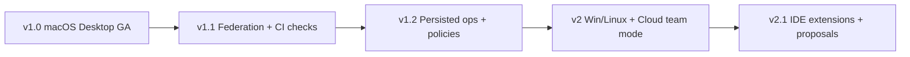

# GraphScope — Product Requirements Document (Phase 1)

| Field | Value |
|---|---|
| Product | GraphScope |
| Document | PRD / Phase 1 |
| Status | Approved for implementation |
| Audience | Engineering, Product, Design, Security |
| Version | 1.4.0 |
| Last updated | 2026-08-05 |
| Primary client | macOS desktop — **local-only, zero GraphScope servers** |

---

## 1. Problem Statement

Engineering organizations adopt GraphQL to improve client flexibility and API evolution, then discover that **GraphQL creates a new class of operational problems** that REST tooling does not solve.

Across a typical mid-to-large engineering org:

1. **Operations are scattered.** Queries and mutations live in `.graphql` / `.gql` files, `gql` / `graphql` tagged templates, Relay/Apollo colocated documents, codegen inputs, mobile clients, BFF layers, and ad-hoc scripts. There is no authoritative inventory of “what GraphQL do we actually run?”
2. **Execution is detached from source of truth.** Engineers paste queries into GraphiQL, Postman, or Insomnia. Those tools do not know which repository owns the operation, whether it still matches the registered schema, or whether it violates org policy.
3. **Schema change is opaque.** Subgraphs evolve independently. Breaking changes land in pull requests without a team-wide registry, consumer impact view, or enforceable check gate.
4. **Performance and quality are afterthoughts.** Deep nesting, unbounded lists, over-fetching, N+1 patterns, and introspection in production are discovered via outages and slow traces—not in the developer workspace.
5. **AI assistance is ungrounded.** Generic copilots suggest invalid fields, ignore org lint rules, and risk leaking secrets or proprietary SDL into model providers.

**GraphScope is the system of record for GraphQL** inside an engineering organization. It closes the loop:

> **Discover → Understand → Execute → Analyze → Improve**

---

## 2. Existing Solutions

| Tool | Primary strength | Primary gap relative to GraphScope |
|---|---|---|
| **Postman** | Desktop app, collections, env, team sync | GraphQL is secondary; no repo-native discovery; weak schema graph; no federation registry |
| **GraphiQL / Altair / Insomnia** | Fast interactive execution | Single-endpoint toys; no org tenancy; no discovery; no analytics; no CI |
| **Apollo Studio / GraphOS** | Schema registry, checks, usage reporting | Strong inside Apollo runtime; weak cross-repo operation discovery; expensive; less “daily workspace IDE” |
| **GraphQL Voyager** | Schema relationship visualization | Visualization only; no execution, registry, or team features |
| **GraphQL Inspector** | Schema diffs and CI breaking-change detection | CI-centric; not a daily collaborative workspace |
| **Hasura Console / Supabase** | Excellent for their backends | Vendor-specific; not a general GraphQL platform |
| **Sourcegraph / GitHub code search** | Find strings across repos | Not GraphQL-semantic; no execute, validate, or analyze loop |
| **Hive / GraphQL Hive** | Schema registry & usage (open ecosystem) | Less emphasis on VCS-first operation inventory + Postman-class workspace |

---

## 3. Why Current Tools Are Insufficient

### 3.1 No end-to-end control loop

No mainstream product connects:

`git commit → discovered operation → validated against registry → executed with environment secrets → performance/anti-pattern score → PR comment / policy gate`

Teams stitch five tools and still miss coverage.

### 3.2 No cross-repo consumer graph

API owners cannot answer: “Who queries `User.email`?” across web, mobile, and internal tools without custom scraping.

### 3.3 No enterprise execution posture

Executing GraphQL against staging/production requires RBAC, secret vaulting, audit logs, SSRF-safe proxies, and environment promotion—rarely present in open GraphiQL embeds.

### 3.4 AI without schema grounding

Copilots that lack registered SDL, operation AST context, and org rule packs produce plausible-but-wrong GraphQL and create security review burden.

---

## 4. Vision

**GraphScope is the open source Postman for GraphQL** — a free, local desktop workspace where engineers discover operations from repos, explore schemas, run queries against any environment, and catch breaking changes before they ship.

**Tagline:** *Ship GraphQL with confidence.*

**North-star experience:** A developer clones GraphScope from GitHub (or downloads the `.dmg`), opens the Mac app, connects their repo, and uses it **daily** like Postman: collections, environments, history, execute — plus GraphQL-native superpowers (schema registry, Voyager, repo discovery, checks, AI). No account. No subscription. No data sent to GraphScope servers.

---

## 4.1 Delivery Model — Local Desktop (macOS v1, Product Hunt)

GraphScope **v1 is a fully local macOS app**. The maintainer operates **zero application servers**. Phases 1–5 converge on a **signed `.dmg` on GitHub Releases** plus a **static landing page** for Product Hunt.

| Layer | v1 | Maintainer hosts? |
|---|---|---|
| **Client** | macOS `.dmg` (Electron + Next.js) | No — user downloads from GitHub |
| **API** | Local **Express** + Apollo Server on loopback | No |
| **Database** | **PostgreSQL 16 embedded** (local) | No |
| **Data access** | **Knex** migrations + query builder | — |
| **GraphQL client** | **Apollo Client** (renderer) | No |
| **Jobs** | **graphile-worker** (PostgreSQL queue) | No |
| **Secrets** | macOS Keychain (GitHub, OpenAI, env tokens) | No |
| **Landing page** | Static site → GitHub Releases link | **Yes — only deploy** |
| **Distribution** | GitHub Releases + Product Hunt launch | Releases via CI |

**Privacy pitch:** *Your GraphQL workspace never phones home to GraphScope.*

**Why embedded PostgreSQL:** Real Postgres dialect and query patterns (Knex, EXPLAIN, FTS, graphile-worker) with zero user install — Electron bundles `embedded-postgres` ([ADR-0010](../adr/0010-postgresql-knex-express-stack.md)).

**Why Knex:** Versioned migrations and parameterized queries match production SaaS backends; portfolio-demonstrable without cloud hosting.

See [ADR-0005](../adr/0005-desktop-first-macos.md), [ADR-0006](../adr/0006-zero-hosted-infrastructure.md), [ADR-0009](../adr/0009-open-source-apache-2.md), [ADR-0010](../adr/0010-postgresql-knex-express-stack.md).

---

## 4.3 Open Source & Postman-Class Daily Use

GraphScope is **100% open source** (Apache 2.0). Anyone can clone, build, fork, and contribute on GitHub. Users install the app and use it **like Postman** for GraphQL — not a demo, not a portfolio toy, but a **daily driver**.

### 4.3.1 What “use it like Postman” means

| Postman habit | GraphScope equivalent (v1) |
|---|---|
| Desktop app in the dock | macOS `.app` from GitHub Releases |
| Collections of requests | **Collections** of GraphQL operations |
| Environments (dev/staging/prod) | **Environments** with URLs + headers |
| Secret variables | **Keychain-backed** env secrets |
| Request history | **Execution history** with latency/errors |
| Run request + see response | **Operation runner** with variables JSON |
| Search / organize APIs | **⌘K search** + filters |
| Share with team (export) | **Export/import** workspace bundle (P1) |
| Free to use locally | **Free OSS** — no GraphScope account |

### 4.3.2 What GraphScope adds beyond Postman (GraphQL-only)

| Capability | Postman | GraphScope |
|---|---|---|
| Auto-discover ops from repos | No | **Yes** |
| Schema registry + breaking-change checks | Weak | **Yes** |
| Schema graph (Voyager-class) | No | **Yes** |
| Anti-pattern / complexity scoring | No | **Yes** |
| Schema-aware AI copilot | Generic | **Yes** (user OpenAI key) |
| GraphQL-first editor + validation | Secondary | **Primary** |

### 4.3.3 Open source distribution model

```text
GitHub repo (source)  →  user clones or downloads Release
GitHub Releases       →  GraphScope-{version}.dmg (signed)
Landing page          →  “Download for Mac” → latest Release
Product Hunt          →  same story: free, open source, local, Postman-like
```

**No freemium cloud.** Core features are not paywalled because there is no GraphScope cloud in v1.

### 4.3.4 Community & contribution

- Public GitHub repository with Apache 2.0 LICENSE
- CONTRIBUTING.md, CODE_OF_CONDUCT.md, SECURITY.md
- Issue templates (bug, feature, GraphQL parser)
- `good first issue` labels for contributors
- GitHub Discussions for Q&A (optional)

---

## 4.2 Product Hunt & Launch Requirements

| Requirement | Detail |
|---|---|
| One-liner | GraphQL workspace for Mac — discover, run, and analyze queries locally |
| Demo | 60–90s GIF from desktop app; no login to GraphScope servers |
| Download CTA | Landing → GitHub Releases latest `.dmg` |
| Maker comment | Emphasize local-first, open source, no account required |
| Hunter assets | Icon, 3 screenshots, tagline — from `docs/images/desktop/` |
| Day-1 support | GitHub Issues only — no SLA server dependency |

---

## 5. Product Principles

1. **VCS-first** — Git is the source of operations; the UI is a lens, not a silo.
2. **Schema is law** — Execution and AI are constrained by registered schema versions.
3. **Workspace isolation is non-negotiable** — Cross-workspace data leaks are SEV-0 bugs (local SQL filters).
4. **Local-first privacy** — No GraphScope server receives user schemas, operations, or tokens.
5. **Safe by default** — SSRF blocks, Keychain secrets, complexity limits, audit trails.
6. **SQL as contract** — Migrations are reviewed DDL; no hidden ORM magic.
7. **Portfolio-honest engineering** — Layered data model, repositories, desktop shipping.
8. **Desktop-native UX** — Mac app: menus, ⌘K, native install from GitHub `.dmg`.
9. **Zero maintainer ops** — Landing page only; no API/database to babysit.
10. **Open source first** — Apache 2.0; free to use; community contributions welcome ([ADR-0009](../adr/0009-open-source-apache-2.md)).
11. **Postman-familiar UX** — Collections, environments, history, and execute are first-class — GraphQL depth is the differentiator, not the learning curve.

---

## 6. User Personas

### 6.1 Asha — Frontend Engineer

| Attribute | Detail |
|---|---|
| Goals | Find the right query, run it against staging, understand fields, ship UI faster |
| Pain | Hunting queries across repos; GraphiQL with stale schema; unclear variable shapes |
| Success | Opens GraphScope → finds operation → runs with env → copies typed result shape |
| Frequency | Daily |

### 6.2 Ben — Backend / API Owner

| Attribute | Detail |
|---|---|
| Goals | Evolve subgraphs safely; know consumers; block breaking changes in CI |
| Pain | “Did anyone use this field?”; schema PRs reviewed by gut feel |
| Success | Publishes schema → check fails on breaking change → sees impacted operations |
| Frequency | Several times per week |

### 6.3 Cara — Platform / Graph Admin

| Attribute | Detail |
|---|---|
| Goals | Org-wide standards, SSO/RBAC, rate limits, auditability, federation composition |
| Pain | Shadow GraphiQL instances; secrets in `.env` screenshots; no usage policy |
| Success | Enforces persisted-operation policy on prod; reviews audit log for anomalies |
| Frequency | Weekly + incident-driven |

### 6.4 Dev — Staff Engineer / Architect

| Attribute | Detail |
|---|---|
| Goals | Cross-service impact analysis, performance budgets, GraphQL standards |
| Pain | No single map of the graph; anti-patterns proliferate |
| Success | Dashboard of complexity outliers + consumer impact before a major migration |
| Frequency | Weekly |

### 6.5 Eve — Engineering Manager / Director

| Attribute | Detail |
|---|---|
| Goals | Reduce production GraphQL incidents; improve change safety; justify tooling ROI |
| Pain | Incidents blamed on “GraphQL complexity” with no metrics |
| Success | Weekly report: checks failed, ops discovered, p95 latency trends |
| Frequency | Weekly review |

---

## 7. User Stories

Stories are prioritized **P0 (MVP)**, **P1 (post-MVP / stretch in v1.x)**, **P2 (v2)**. Each maps to functional requirement IDs in §8.

### 7.1 Workspace & access (FR-ORG, FR-AUTH, FR-AUDIT)

| ID | Priority | Story | FR |
|---|---|---|---|
| US-001 | P0 | As a new user, I create a local workspace on first launch — no GraphScope account. | FR-ORG |
| US-002 | P0 | As a user, I connect GitHub via Device Flow or PAT stored in Keychain. | FR-AUTH |
| US-003 | P0 | As a user, I create multiple local workspaces (e.g. work vs OSS). | FR-ORG |
| US-004 | P1 | As a user, I export/import a workspace backup file. | FR-ORG |
| US-005 | P0 | As a user, I view an append-only audit log of sensitive local actions. | FR-AUDIT |

### 7.2 VCS & discovery (FR-VCS, FR-DISC)

| ID | Priority | Story | FR |
|---|---|---|---|
| US-010 | P0 | As Asha, I add a GitHub repo URL or local folder to index. | FR-VCS |
| US-011 | P0 | As Asha, I trigger reindex when I pull latest main. | FR-VCS |
| US-012 | P0 | As Asha, I see last indexed commit SHA and sync status. | FR-VCS, FR-DISC |
| US-013 | P0 | As Asha, I browse discovered operations with filters. | FR-DISC |
| US-014 | P0 | As Asha, I open an operation with source path and line range. | FR-DISC |
| US-015 | P1 | As Asha, I schedule automatic reindex every N hours (local poll). | FR-VCS |
| US-016 | P0 | As an editor, I manually mark/unmark a document as an operation. | FR-DISC |
| US-017 | P1 | As Dev, I see confidence scores and parser warnings per document. | FR-DISC |
| US-018 | P2 | As an admin, I connect GitLab/Bitbucket similarly. | FR-VCS |

### 7.3 Schema registry (FR-REG, FR-CLI)

| ID | Priority | Story | FR |
|---|---|---|---|
| US-020 | P0 | As Ben, I publish SDL via CLI using an API key. | FR-REG, FR-CLI |
| US-021 | P0 | As Ben, I see schema versions with content hash, author, git SHA, timestamp. | FR-REG |
| US-022 | P0 | As Ben, I run a schema check (breaking/dangerous/safe) against the previous version. | FR-REG, FR-CLI |
| US-023 | P0 | As CI, a failing breaking-change check fails the pipeline. | FR-REG, FR-CLI |
| US-024 | P0 | As Ben, I view a semantic schema diff in the UI. | FR-REG |
| US-025 | P1 | As Cara, I compose Federation v2 subgraphs into a supergraph and see composition errors. | FR-REG |
| US-026 | P1 | As Ben, I open a schema proposal PR workflow inside GraphScope. | FR-REG |
| US-027 | P2 | As Dev, I see field-level usage overlays from analytics on the schema. | FR-REG, FR-ANAL |

### 7.4 Visualization & search (FR-VIZ, FR-SEARCH)

| ID | Priority | Story | FR |
|---|---|---|---|
| US-030 | P0 | As Asha, I explore the schema graph visually (Voyager-class). | FR-VIZ |
| US-031 | P0 | As any member, I globally search operations, types, fields, repos, collections. | FR-SEARCH |
| US-032 | P1 | As Dev, I click a type in Voyager and see top consumer operations. | FR-VIZ, FR-ANAL |

### 7.5 Execution workspace (FR-EXEC, FR-COLL)

| ID | Priority | Story | FR |
|---|---|---|---|
| US-040 | P0 | As Asha, I create environments (local/staging/prod) with endpoint URLs and headers. | FR-COLL |
| US-041 | P0 | As an admin, I store secrets (tokens) encrypted; values are never returned in plaintext after write. | FR-EXEC |
| US-042 | P0 | As Asha, I execute an operation against an environment and see status, latency, size, errors. | FR-EXEC |
| US-043 | P0 | As Asha, I browse personal/workspace execution history. | FR-EXEC, FR-COLL |
| US-044 | P0 | As an editor, I save operations into collections and share within the workspace. | FR-COLL |
| US-045 | P0 | As Runner+, I am blocked from prod execute without role permission. | FR-EXEC, FR-ORG |
| US-046 | P1 | As Cara, I require persisted operation hashes for production environments. | FR-EXEC |
| US-047 | P1 | As Asha, I compare two execution responses (diff). | FR-EXEC |

### 7.6 Analytics & quality (FR-ANAL)

| ID | Priority | Story | FR |
|---|---|---|---|
| US-050 | P0 | As Dev, I see complexity and depth scores for an operation. | FR-ANAL |
| US-051 | P0 | As Dev, I see anti-pattern findings with rule IDs and remediation hints. | FR-ANAL |
| US-052 | P0 | As Eve, I view a workspace dashboard: ops count, check failures, p50/p95 execute latency. | FR-ANAL |
| US-053 | P1 | As Ben, I receive PR check annotations for new anti-patterns introduced by a PR parse. | FR-ANAL, FR-VCS |
| US-054 | P2 | As Cara, I set performance budgets that fail CI when exceeded. | FR-ANAL |

### 7.7 AI Copilot (FR-AI)

| ID | Priority | Story | FR |
|---|---|---|---|
| US-060 | P0 | As Asha, I ask GraphScope to explain an operation in plain language with type citations. | FR-AI |
| US-061 | P0 | As Asha, I generate a query from natural language constrained to a schema version. | FR-AI |
| US-062 | P0 | As Cara, I choose AI redaction mode (strict / standard / full-schema). | FR-AI |
| US-063 | P1 | As Ben, I get migration suggestions when a schema check flags a breaking change. | FR-AI, FR-REG |
| US-064 | P2 | As Asha, I use inline AI fix for validation errors in the editor. | FR-AI |

### 7.8 Notifications (local)

| ID | Priority | Story | FR |
|---|---|---|---|
| US-070 | P0 | As Asha, I get an in-app notification when a schema check fails. | FR-NOTIF |
| US-071 | P1 | As Asha, I get a macOS Notification Center alert when a long reindex completes. | FR-NOTIF |

### 7.9 Desktop client (FR-DESKTOP)

| ID | Priority | Story | FR |
|---|---|---|---|
| US-080 | P0 | As Asha, I download the open source `.dmg` from GitHub Releases or build from source. | FR-DESKTOP, FR-OSS |
| US-081 | P0 | As Asha, the app starts the local API and shows when it is ready. | FR-DESKTOP |
| US-082 | P0 | As Asha, I connect GitHub via Device Flow without a GraphScope account. | FR-DESKTOP, FR-AUTH |
| US-083 | P0 | As Asha, I use ⌘K to search like Postman's search but for GraphQL ops/schemas. | FR-DESKTOP, FR-SEARCH |
| US-084 | P1 | As Asha, the app auto-updates from GitHub Releases. | FR-DESKTOP |

### 7.10 Daily workspace — Postman-like (FR-COLL, FR-EXEC, FR-OSS)

| ID | Priority | Story | FR |
|---|---|---|---|
| US-090 | P0 | As Asha, I save operations to **collections** organized like Postman folders. | FR-COLL |
| US-091 | P0 | As Asha, I switch **environments** and re-run the same operation. | FR-COLL, FR-EXEC |
| US-092 | P0 | As Asha, I browse **execution history** with timing and errors. | FR-EXEC |
| US-093 | P0 | As Asha, I use a single runner for query, variables, and headers. | FR-EXEC |
| US-094 | P0 | As anyone, I use GraphScope for free with no signup — it's open source. | FR-OSS |
| US-095 | P1 | As Asha, I export a collection/workspace file to share with my team. | FR-COLL, FR-OSS |

---

## 8. Functional Requirements

### FR-ORG — Local workspace model

- Hierarchy: **Workspace → Project** (no cloud org)
- Multiple workspaces per Mac; data in local PostgreSQL with `workspace_id` FK on all scoped tables
- Optional workspace export (zip: db slice + schema files)

### FR-AUTH — Authentication (local)

- **No GraphScope login server**
- GitHub **Device Flow** or **PAT** → Keychain
- OpenAI API key → Keychain (for AI features)
- Local session in PostgreSQL (`core_session`); optional Redis cache when configured

### FR-VCS — Version control (local)

- Add repo: GitHub URL (clone with user token) or **local filesystem path**
- Manual + scheduled **Reindex** — no GraphScope webhooks
- `.graphscopeignore` support

### FR-DISC — Operation discovery

- Parsers for:
  - `.graphql` / `.gql` documents
  - `gql` / `graphql` tagged templates (Babel)
  - TypeScript/JavaScript via TS Compiler API heuristics
  - Common codegen document globs
- Persist: operation type, name (or anonymous hash), variable definitions, selection set summary, content hash (normalized), source map, confidence score.
- Deduplicate by `(project_id, content_hash)` while retaining multiple source locations.

### FR-REG — Schema registry (local)

- SDL import via UI, CLI, or file watch
- Versions in `core_schema_version` + files on disk (SCD Type 2)
- Checks via GraphQL Inspector in local job queue
- **No remote registry server**

### FR-DATA — Local database (normative)

- **Default:** Embedded PostgreSQL at Application Support path
- **Migrations & queries:** Knex 3 (PostgreSQL dialect)
- **Optional:** External local Postgres URL in Settings (power users)
- **Optional:** Local Redis for SDL/session cache
- Layered tables: `stg_`, `core_`, `mart_`, `audit_` per [02-local-data-engineering.md](./02-local-data-engineering.md)
- Analytics scripts in `scripts/analytics/` using Knex

### FR-VIZ — Visualization

- Interactive schema explorer (GraphQL Voyager-class).
- Navigate types/fields; deep-link from operation validation errors to types.

### FR-EXEC — Execution proxy

- Authenticated proxy to customer GraphQL HTTP endpoints.
- Environments: URL, default headers, secret references.
- Limits: timeout (default 30s), response body cap (5MB), redirect policy (0).
- SSRF protections (see System Design).
- Execution history with redacted headers/secrets.

### FR-COLL — Collections & environments

- Collections of saved operations (discovered or authored).
- Environment promotion model (no secret leakage across envs).
- Share within workspace; optional read-only public links (P2, off by default).

### FR-ANAL — Analytics & anti-patterns

- Persist execution metrics: latency, transport errors, GraphQL errors, response bytes.
- Static scores: depth, complexity estimate, fan-out heuristics.
- Rule packs with stable rule IDs (e.g. `GS001_UNBOUNDED_LIST`).
- Workspace dashboards and rollups.

### FR-AI — AI Copilot

- Capabilities: explain, generate, (P1) migrate.
- Grounding: registered schema subset + operation AST.
- Never include secret values in prompts.
- Org-level redaction modes and monthly token budgets.
- Provider: OpenAI via LangChain abstraction (swappable).

### FR-SEARCH — Search

- PostgreSQL full-text search (`tsvector` + GIN) over operations, types, fields
- `search.reindex` graphile-worker task
- No OpenSearch / external search service required

### FR-NOTIF — Notifications (local)

- In-app toasts and optional macOS notifications on job complete
- No email/Slack server (user may use macOS Notification Center only)

### FR-LANDING — Maintainer landing page

- Static marketing site with PH-ready copy, screenshots, GitHub Releases download button
- **Only component deployed by maintainer**

### FR-AUDIT — Audit log

- Append-only events for authz-sensitive actions (login, key create/revoke, secret write, prod execute, role change, schema delete).
- Queryable by actor, action, resource, time range.
- Retention: ≥ 1 year (configurable).

### FR-CLI — CLI

- Package: `@graphscope/cli`
- Commands (MVP): `login`, `schema:publish`, `schema:check`, `whoami`
- P1: `persisted-ops:upload`, `project:list`

### FR-OSS — Open source product

- **License:** Apache 2.0
- **Source:** public GitHub repository
- **Binaries:** GitHub Releases (`.dmg`); build-from-source documented
- **Cost:** free for all core features — no GraphScope account or subscription
- **Contribution:** CONTRIBUTING.md, issue/PR templates, good-first-issues
- **Sharing:** export/import collections and workspace bundles (P1)

### FR-DESKTOP — macOS desktop client

- Installable `.dmg` from **GitHub Releases** (linked on landing page)
- Electron + Next.js; spawns local API — **no Docker**
- Knex migrate on startup (embedded PostgreSQL)
- Product Hunt launch-ready assets

---

## 9. Non-Functional Requirements

| ID | Category | Requirement |
|---|---|---|
| NFR-S1 | Scale | Single-user Mac: 10k+ operations, 1k+ executions/day per workspace |
| NFR-L1 | Latency | p95 local UI reads < 200ms |
| NFR-L2 | Latency | Execute proxy overhead < 50ms p95 excluding upstream |
| NFR-SEC1 | Security | Keychain secrets; SSRF guards; API on 127.0.0.1 only |
| NFR-ISO1 | Isolation | Every SQL query filters `workspace_id` |
| NFR-PRIV1 | Privacy | No telemetry to GraphScope servers by default |
| NFR-OPS0 | Maintainer ops | **Zero** always-on servers |
| NFR-OSS1 | Open source | All core features usable without payment or cloud account |
| NFR-UX1 | UX | Postman-familiar: collections, envs, history, runner; ⌘K search |
| NFR-D1 | Desktop | Cold start to usable UI < 5s on M-series Mac |
| NFR-D3 | Desktop | Signed + notarized `.dmg` on GitHub Releases |

---

## 10. Success Metrics

### 10.1 Product metrics

| Metric | Target (MVP design partners) |
|---|---|
| Time-to-first-indexed-repo after GitHub App install | < 10 minutes |
| Operation discovery recall on golden fixture repos | ≥ 80% |
| Schema check detection rate on breaking-change fixture suite | 100% |
| Weekly active editors / provisioned seats | ≥ 40% |
| Execute success rate (exclude upstream 5xx) | ≥ 99% platform success |

### 10.2 Engineering metrics

| Metric | Target |
|---|---|
| Staging p95 interactive latency | Meets NFR-L1 |
| Cross-tenant isolation test suite | 100% pass, required in CI |
| Mean time to deploy hotfix to staging | < 30 minutes |
| Open critical vulns in deps | 0 |

### 10.3 Portfolio / narrative metrics

- Demo script completes in < 8 minutes without narrator debugging.
- Architecture docs sufficient for a senior engineer to extend a service in < 1 day.

---

## 11. Business Goals

### 11.1 Open source & portfolio positioning

GraphScope is an **open source, Postman-class GraphQL workspace** — portfolio-worthy because it ships a real desktop product people can use daily, not a README-only demo.

Demonstrates:

- Open source desktop delivery (Electron + signed `.dmg`)
- **Express + GraphQL + PostgreSQL + Knex** backend (local embedded PG)
- Apollo Client integration in renderer
- graphile-worker background jobs; optional local Redis
- GraphQL depth (discovery, registry, checks, Voyager, SSRF-safe execute)
- Zero-ops maintainer model (landing page only)

**Interview narrative:** “I built and open-sourced Postman for GraphQL — a local Mac app with Express, GraphQL, PostgreSQL, and Knex: repo discovery, schema registry, background workers, and a Postman-like daily workflow, with zero servers to operate.”

### 11.2 Community goals (non-binding)

- 500+ GitHub stars in year one post Product Hunt
- 10+ external contributors
- Featured on Product Hunt GraphQL / developer tools

---

## 12. Competitive Analysis

### 12.1 Positioning map

| Dimension | Postman | Apollo Studio | GraphScope |
|---|---|---|---|
| **Open source core** | Freemium cloud | Proprietary | **Apache 2.0, fully local** |
| **Daily desktop use** | Excellent | Web-first | **Excellent (Mac v1)** |
| GraphQL depth | Medium | High | **Very high (exclusive focus)** |
| Collections + envs + history | Yes | Partial | **Yes (Postman parity)** |
| VCS-native discovery | No | Medium | **Yes** |
| Schema registry + checks | Weak | High | **Yes** |
| Price to start | Free tier + cloud | Paid | **Free — download and go** |

### 12.2 Differentiation thesis

1. **The open source Postman for GraphQL** — familiar daily workflow, GraphQL-native depth.
2. **Free and local** — no account, no maintainer servers, Apache 2.0.
3. **Repo-native discovery + schema registry** in the same app you execute from.

### 12.3 Non-goals vs competitors

- Not a general REST/gRPC platform (Postman breadth).
- Not an API runtime / gateway for production traffic (Apollo Router territory).
- Not a backend-as-a-schema generator (Hasura).

---

## 13. MVP Scope

### 13.1 In scope (must ship)

| Area | Capability |
|---|---|
| Auth & workspace | Local workspace, GitHub Device Flow/PAT, Keychain |
| VCS | Local folder + GitHub clone, manual/scheduled reindex |
| Discovery | Multi-strategy parser, operation browser |
| Registry | Local SDL + Inspector checks |
| Execution | Environments, Keychain secrets, local proxy |
| Viz | Voyager-class explorer |
| Analytics | Complexity/depth, rule pack, dashboard |
| AI | Explain/generate with user's OpenAI key |
| Search | PostgreSQL full-text search |
| Audit | Local append-only audit log |
| CLI | `schema:publish`, `schema:check` → localhost |
| Database | **PostgreSQL + Knex** migrations |
| Jobs | **graphile-worker** (parse, check, rollup, reindex) |
| GraphQL client | **Apollo Client** |
| Distribution | GitHub Releases `.dmg` + landing page |
| Open source | Apache 2.0, CONTRIBUTING, public repo |
| Postman-like UX | Collections, environments, history, runner |

### 13.2 Explicitly out of MVP

- GraphScope-hosted servers / cloud SaaS deploy
- AWS Lambda, SQS, API Gateway (cloud infra)
- Maintainer-operated PostgreSQL or Redis
- Prisma or full ORM abstraction
- NestJS (Express is v1 API framework)
- GitHub App / webhooks / cloud OAuth
- Windows / Linux desktop
- Email/Slack notification servers
- SAML/OIDC SSO
- GitLab / Bitbucket
- Real-time collab, marketplace, mobile
- BYOC / customer-VPC
- VS Code extension
- Cloud team sync
- OpenSearch / Elasticsearch cluster

---

## 14. Stretch Features

| Feature | Priority | Notes |
|---|---|---|
| Federation composition UI | P1 | Milestone M8 |
| Persisted queries enforcement | P1 | Prod policy |
| Slack app | P1 | Notifications |
| Schema proposals/reviews | P1–P2 | Change management |
| Consumer impact graph | P1–P2 | Field → operations |
| Query cost estimation | P2 | Requires usage weighting |
| VS Code extension | P2 | Thin client on APIs |
| GitLab support | P2 | Mirror GitHub App flows |
| SAML SSO | P1 | Enterprise checkbox |
| Self-host Helm “lite” | P1 | Portfolio + real users |
| Windows desktop build | P2 | Same Electron shell |
| Linux desktop build (AppImage/deb) | P2 | Same Electron shell |
| Cloud-hosted team workspace | P2 | Optional sync layer |
| Homebrew cask | P1 | Mac distribution |

---

## 15. Risks

| ID | Risk | Likelihood | Impact | Mitigation |
|---|---|---|---|---|
| R1 | Parser false negatives/positives | H | H | Golden fixtures; confidence scores; manual override; iterative heuristics |
| R2 | SSRF via execution proxy | M | H | DNS allowlist/block private ranges; egress proxy; timeouts; size caps; security tests |
| R3 | AI schema/secret leakage | M | H | Redaction modes; never send secrets; audit AI prompts metadata; opt-in full schema |
| R4 | Microservice overhead for solo delivery | H | M | Shared packages; compose locally; thin services; strict milestone cuts |
| R5 | GitHub API rate limits | M | M | App auth; conditional requests; incremental sync; backoff queues |
| R6 | Scope creep toward “another Postman” | H | H | GraphQL-only product principle; reject REST roadmap |
| R7 | Federation complexity delays MVP | M | M | Non-federated registry first; Federation in M8 |
| R8 | OpenSearch ops burden | M | M | Compose for local; managed OpenSearch in staging/prod; fallback degraded search |
| R9 | Demo data unconvincing | M | M | Curated sample monorepo + fake subgraph + seed script |
| R10 | PostgreSQL corruption on crash | L | H | WAL mode; checkpoint on quit; backup export |
| R11 | Mac notarization friction | M | M | Phase 5 checklist; CI macos job |
| R12 | Product Hunt traffic spike | L | L | GitHub Releases CDN; no server to overload |
| R13 | User expects cloud sync | M | M | Clear "local-only v1" messaging on landing |

---

## 16. Constraints

| Constraint | Implication |
|---|---|
| Fixed tech stack (Express, Next.js, Knex, PostgreSQL, graphile-worker, Apollo, etc.) | Design within stack; no re-litigation without ADR |
| Greenfield empty repository | Spec docs land before application code |
| Portfolio / solo-capable timeline | Independently deployable milestones; ruthless MVP cut |
| No real customer data in demos | Synthetic schemas and fixtures only |
| Thousands of users / millions of operations (design target) | Partitioning, queues, caching, pagination mandatory—not optional polish |
| **v1 primary deliverable** | Local Mac `.dmg` + landing page; **zero GraphScope servers** |
| **No ORM** | All persistence via SQL migrations + repositories |
| **PostgreSQL embedded** | Optional external PG URL; optional local Redis; no managed cloud DB |

---

## 17. Future Roadmap



| Version | Themes |
|---|---|
| **v1.0** | **macOS desktop app** — auth, discovery, registry, execute, viz, analytics, AI, search; signed `.dmg` |
| **v1.1** | Federation composition, richer CI annotations, Slack, Homebrew cask |
| **v1.2** | Persisted operations, prod enforcement policies, consumer impact v1 |
| **v2.0** | Windows + Linux desktop; optional cloud-hosted team workspace; GitLab; SAML |
| **v2.1** | VS Code extension, schema proposal workflow, advanced AI migrate; optional web client |

---

## 18. Roles & Permission Matrix (normative)

| Action | VIEWER | RUNNER | EDITOR | ADMIN | OWNER |
|---|---|---|---|---|---|
| View projects/ops/schemas | ✓ | ✓ | ✓ | ✓ | ✓ |
| Execute non-prod | | ✓ | ✓ | ✓ | ✓ |
| Execute prod | | | | ✓ | ✓ |
| Edit collections/envs (non-secret) | | | ✓ | ✓ | ✓ |
| Write secrets | | | | ✓ | ✓ |
| Enable repos / trigger reindex | | | ✓ | ✓ | ✓ |
| Publish schema | | | ✓ | ✓ | ✓ |
| Manage members/roles | | | | ✓ | ✓ |
| Manage billing/delete org | | | | | ✓ |
| View audit log | | | | ✓ | ✓ |
| Configure AI redaction | | | | ✓ | ✓ |

---

## 19. Acceptance Criteria (Phase 1)

Phase 1 documentation is accepted when:

- [x] Problem statement, existing solutions, and gaps are documented.
- [x] Vision and product principles are explicit.
- [x] Five personas with goals/pains/success criteria are defined.
- [x] User stories are prioritized (P0/P1/P2) and mapped to FR IDs.
- [x] Functional requirements cover org, auth, VCS, discovery, registry, viz, execution, collections, analytics, AI, search, notifications, audit, CLI.
- [x] Non-functional requirements include scale, latency, availability, security, isolation, observability, DR.
- [x] Success metrics are measurable.
- [x] Business goals and competitive positioning are stated.
- [x] MVP scope and out-of-scope are unambiguous.
- [x] Stretch features, risks with mitigations, constraints, and roadmap are present.
- [x] RBAC matrix is normative for implementation.
- [x] A senior engineer can derive milestone scope from this PRD without clarifying product intent for MVP.
- [x] Desktop-first macOS v1 delivery model documented (§4.1, FR-DESKTOP, NFR-D*).

**Exit criterion:** Proceed to [02-system-design.md](./02-system-design.md).

---

## Document history

| Version | Date | Notes |
|---|---|---|
| 1.0.0 | 2026-08-05 | Initial PRD from GraphScope engineering specification |
| 1.1.0 | 2026-08-05 | Desktop-first macOS |
| 1.4.0 | 2026-08-05 | PostgreSQL + Knex + Express + Apollo stack (local) |
| 1.2.0 | 2026-08-05 | Local-only (superseded by 1.4) |
| 1.3.0 | 2026-08-05 | Open source + Postman-class daily use; ADR-0009 |
