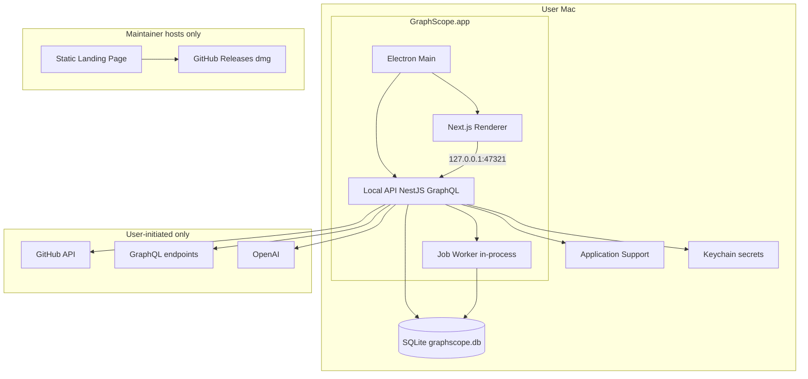
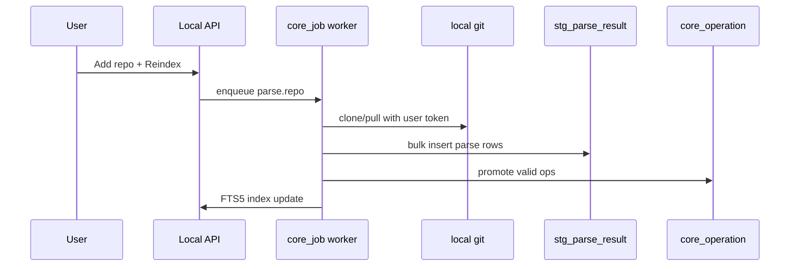

# GraphScope — System Design (Phase 2)

| Field | Value |
|---|---|
| Product | GraphScope |
| Document | System Architecture / Phase 2 |
| Status | Approved for implementation |
| Version | 1.2.0 |
| Last updated | 2026-08-05 |
| Primary client | macOS desktop — **local-only, zero GraphScope servers** |
| Data guide | [02-local-data-engineering.md](./02-local-data-engineering.md) |
| ADRs | … [0009](../adr/0009-open-source-apache-2.md) (open source, Postman-class) |

---

## 1. Goals

Unambiguous architecture for a **Product Hunt–ready macOS app** that:

- Requires **no maintainer servers** (landing page only deploy)
- Stores all data **locally** (SQLite default; optional local MySQL)
- Uses **raw SQL + migrations** — **no ORM**
- Distributes via **GitHub Releases `.dmg`**

Every major decision: **options → choice → why**.

---

## 2. Locked Defaults

| Decision | Choice | Why |
|---|---|---|
| Maintainer infrastructure | **Landing page only** | Zero ops/cost |
| User infrastructure | **Everything on Mac** | Privacy; no account on GraphScope servers |
| Distribution | GitHub Releases `.dmg` | OSS norm; linked from landing + Product Hunt |
| Client | Electron + Next.js renderer | Postman-class desktop |
| API | Single NestJS monolith (`apps/api`) on loopback | [ADR-0008](../adr/0008-local-monolith-api.md) |
| Database (default) | **SQLite 3** embedded | Zero install for PH users |
| Database (optional) | Local **MySQL 8+** / MariaDB | User-configured in Settings |
| Data access | **No ORM** — `better-sqlite3` / `mysql2` + repositories | User requirement; data engineering control |
| Schema | Versioned SQL in `database/migrations/` | DDL is source of truth |
| Modeling | `stg_` / `core_` / `mart_` / `audit_` layers | Data engineering practice |
| Search | SQLite **FTS5** | No OpenSearch |
| Jobs | `core_job` table + in-process worker | No Redis/BullMQ |
| SDL files | `~/Library/Application Support/GraphScope/schemas/` | No S3 |
| GitHub | Device Flow / user PAT + local `git` | No GraphScope GitHub App / webhooks |
| AI | User's OpenAI key in Keychain | No GraphScope AI proxy |
| GraphQL | Single local schema | Federation deferred to v2 cloud |

**Removed from v1:** PostgreSQL, Prisma, Redis, Docker Compose, K8s, microservices, Federation gateway, OpenSearch, cloud SaaS.

---

## 3. High-Level Architecture



---

## 4. Monorepo Structure

```text
GraphScope/
  apps/
    desktop/          # Electron
    web/              # Renderer UI
    api/              # Local NestJS monolith
    landing/          # Static marketing — ONLY deploy
    cli/
  database/
    migrations/sqlite/
    migrations/mysql/
    docs/DATA_DICTIONARY.md
  packages/
    db/               # Repositories — raw SQL
    auth/
    config/
    shared-types/
    graphql-schema/
    ui/
  deploy/electron/
  docs/spec/ + docs/adr/
```

### Startup sequence

1. User opens GraphScope.app
2. Main: run pending SQLite migrations
3. Main: spawn `apps/api` → wait for `/healthz`
4. Main: open window → renderer loads
5. Quit: stop API, `PRAGMA wal_checkpoint`

---

## 5. Local API Modules

| Module | Responsibility |
|---|---|
| `WorkspaceModule` | Local workspaces |
| `AuthModule` | Session + GitHub token refs |
| `CatalogModule` | Projects, schemas, envs, collections |
| `ParserModule` | Git clone, parse, staging → core promotion |
| `ExecutionModule` | Proxy + SSRF guards |
| `AnalyticsModule` | Rules, findings, `mart_*` rollups |
| `AiModule` | OpenAI with user key |
| `SearchModule` | FTS5 |
| `JobModule` | Poll `core_job` |

GraphQL endpoint: `http://127.0.0.1:47321/graphql`

---

## 6. Authentication

| Secret | Storage |
|---|---|
| GitHub (Device Flow / PAT) | Keychain |
| OpenAI API key | Keychain |
| Environment tokens | Keychain |
| App session | SQLite `core_session` |

**No GraphScope OAuth server.** GitHub Device Flow recommended ([no callback server needed](https://docs.github.com/en/apps/oauth-apps/building-oauth-apps/authorizing-oauth-apps#device-flow)).

---

## 7. Authorization

- **Workspace-scoped** RBAC (roles unchanged from PRD matrix)
- Every SQL query includes `workspace_id` filter
- CI tests: workspace A cannot read workspace B rows

---

## 8. Schema Registry (local)

1. User publishes SDL via UI or CLI → file on disk + `core_schema_version` row (SCD Type 2)
2. Check job enqueued in `core_job` → GraphQL Inspector rules → `core_schema_check`
3. Diff rendered in UI from normalized SDL strings

No S3. No remote registry.

---

## 9. Parser Pipeline



- Local path or GitHub clone into Application Support
- Same parser strategies: `.graphql`, Babel tagged templates, TS heuristics
- `.graphscopeignore` supported

---

## 10. Execution & SSRF

Unchanged security posture — execution proxy runs in local API:

- DNS resolve → block private/metadata IPs (configurable for localhost dev)
- Timeout 30s, body cap 5MB, redirects 0
- History in `core_execution` table

---

## 11. Analytics

- Static rules on parse → `core_operation_finding`
- Execution metrics → `mart_workspace_daily` rollups
- Cron via `core_job` scheduled rows (daily rollup)

---

## 12. AI Copilot

- User provides OpenAI key in Settings
- LangChain in `AiModule`; schema subset from local SDL files
- Redaction modes; no data sent to GraphScope servers

---

## 13. Search

SQLite FTS5 virtual tables maintained by triggers on `core_operation` / schema types.

---

## 14. Security

| Threat | Control |
|---|---|
| SSRF | Same as §10 |
| Local DB tampering | File permissions; app-signed bundle |
| Secret leak | Keychain only for tokens |
| Supply chain | Lockfile, CodeQL, signed dmg |

API binds **127.0.0.1 only** — not reachable from network.

---

## 15. Deployment

### Maintainer (only)

| Asset | Where |
|---|---|
| Landing page | Vercel / Cloudflare Pages / GitHub Pages |
| `.dmg` | GitHub Releases (CI builds on tag) |

### User

Download `.dmg` from GitHub → drag to Applications → run. No account signup on GraphScope servers.

### CI

- `ci.yml` — lint, test, migration smoke on SQLite `:memory:`
- `release-mac.yml` — sign, notarize, upload to Releases

**No** Docker, K8s, or cloud API deploy in v1.

---

## 16. Observability (local)

- Structured logs to `Application Support/logs/graphscope.log`
- Optional dev verbose mode
- No Prometheus/Grafana required for v1

---

## 17. Design Tradeoffs

| Topic | v1 choice | v2+ if needed |
|---|---|---|
| SQLite vs MySQL | SQLite default | Optional MySQL connection |
| Monolith vs microservices | Monolith | Cloud team server |
| Federation | Single schema | Apollo Federation |
| Webhooks | Manual/poll reindex | Cloud relay |
| Multi-device sync | None | Optional cloud backup |

---

## 18. Acceptance Criteria (Phase 2)

- [x] Zero hosted backend architecture documented
- [x] SQLite + raw SQL + layered modeling referenced
- [x] Local monolith API specified
- [x] GitHub Device Flow / PAT model
- [x] Landing + GitHub Releases distribution
- [x] SSRF and local-only API binding
- [x] ADRs 0006–0008 + data engineering companion doc

**Exit criterion:** [03-feature-breakdown.md](./03-feature-breakdown.md)

---

## Document history

| Version | Date | Notes |
|---|---|---|
| 1.0.0 | 2026-08-05 | Initial (cloud/microservices) |
| 1.1.0 | 2026-08-05 | Desktop-first |
| 1.2.0 | 2026-08-05 | Local-only, SQLite, no ORM, PH/GitHub Releases |
