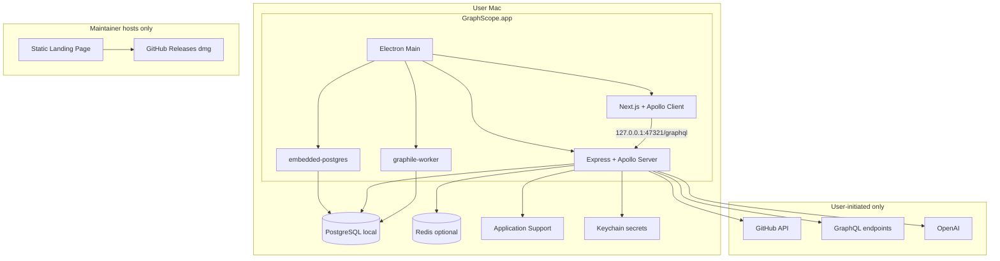
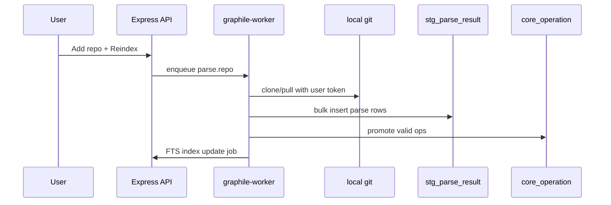

# GraphScope — System Design (Phase 2)

| Field | Value |
|---|---|
| Product | GraphScope |
| Document | System Architecture / Phase 2 |
| Status | Approved for implementation |
| Version | 1.4.0 |
| Last updated | 2026-08-05 |
| Primary client | macOS desktop — **local-only, zero GraphScope servers** |
| Data guide | [07-local-data-engineering.md](./07-local-data-engineering.md) |
| Design system | [06-design-system.md](./06-design-system.md) |
| ADRs | [0010](../adr/0010-postgresql-knex-express-stack.md), [0009](../adr/0009-open-source-apache-2.md) |

---

## 1. Goals

Unambiguous architecture for a **Product Hunt–ready macOS app** that:

- Requires **no maintainer servers** (landing page only deploy)
- Stores all data **locally** in **embedded PostgreSQL**
- Uses **Knex** for migrations and repository queries
- Runs **Express + Apollo Server** GraphQL API on loopback
- Uses **Apollo Client** in the renderer
- Distributes via **GitHub Releases `.dmg`**

Every major decision: **options → choice → why**.

---

## 2. Locked Defaults

| Decision | Choice | Why |
|---|---|---|
| Maintainer infrastructure | **Landing page only** | Zero ops/cost |
| User infrastructure | **Everything on Mac** | Privacy; no account on GraphScope servers |
| Distribution | GitHub Releases `.dmg` | OSS norm; linked from landing + Product Hunt |
| Client | Electron + Next.js + **Apollo Client** + **shadcn/ui** | Postman-class desktop; [06-design-system.md](./06-design-system.md) |
| API | **Express** modular monolith (`apps/api`) on loopback | [ADR-0008](../adr/0008-local-monolith-api.md), [ADR-0010](../adr/0010-postgresql-knex-express-stack.md) |
| Database | **PostgreSQL 16 embedded** (`embedded-postgres`) | Real Postgres; zero user install |
| Data access | **Knex 3** migrations + query builder | Industry-standard; reviewable SQL |
| Modeling | `stg_` / `core_` / `mart_` / `audit_` layers | Data engineering practice |
| Search | **PostgreSQL FTS** (`tsvector` + GIN) | [ADR-0004](../adr/0004-opensearch-for-search.md) |
| Jobs | **graphile-worker** (PostgreSQL queue) | Background workers without cloud SQS |
| Cache (optional) | Local **Redis** via `ioredis` | Graceful degrade if absent |
| SDL files | `~/Library/Application Support/GraphScope/schemas/` | No S3 |
| GitHub | Device Flow / user PAT + local `git` | No GraphScope GitHub App / webhooks |
| AI | User's OpenAI key in Keychain | No GraphScope AI proxy |
| GraphQL | Single local schema | Federation deferred to v2 cloud |

**Removed from v1:** Cloud Postgres/Redis, NestJS, Prisma, SQLite, Docker requirement for users, microservices, Federation gateway, OpenSearch, maintainer-operated SaaS.

---

## 3. High-Level Architecture



---

## 4. Monorepo Structure

```text
GraphScope/
  apps/
    desktop/          # Electron — spawn PG, API, worker
    web/              # Next.js renderer + Apollo Client
    api/              # Express + Apollo Server monolith
    landing/          # Static marketing — ONLY deploy
    cli/
  database/
    migrations/       # Knex migrations (PostgreSQL)
    seeds/
    docs/DATA_DICTIONARY.md
  scripts/
    analytics/        # Knex rollup scripts
    migrate.ts
  packages/
    db/               # Knex instance + repositories
    auth/
    config/
    shared-types/
    graphql-schema/
    ui/               # shadcn primitives + GraphScope composites
  deploy/electron/
  docs/spec/ + docs/adr/
```

### Startup sequence

1. User opens GraphScope.app
2. Main: start **embedded-postgres** → wait for ready
3. Main: run pending **Knex migrations**
4. Main: spawn `apps/api` (Express) → wait for `/healthz`
5. Main: start **graphile-worker** poll loop
6. Main: open window → renderer loads Apollo Client
7. Quit: stop worker + API, checkpoint PG, stop embedded-postgres

---

## 5. Local API Modules

| Module | Responsibility |
|---|---|
| `workspace` | Local workspaces; `workspace_id` scoping |
| `auth` | Session + GitHub token refs |
| `catalog` | Projects, schemas, envs, collections |
| `parser` | Git clone, parse, staging → core promotion |
| `execution` | Proxy + SSRF guards |
| `analytics` | Rules, findings, `mart_*` rollups |
| `ai` | OpenAI with user key |
| `search` | PostgreSQL FTS queries |
| `jobs` | graphile-worker task registration |

GraphQL endpoint: `http://127.0.0.1:47321/graphql`

---

## 6. Authentication

| Secret | Storage |
|---|---|
| GitHub (Device Flow / PAT) | Keychain |
| OpenAI API key | Keychain |
| Environment tokens | Keychain |
| App session | PostgreSQL `core_session` (+ optional Redis cache) |

**No GraphScope OAuth server.** GitHub Device Flow recommended.

---

## 7. Authorization

- **Workspace-scoped** RBAC (roles unchanged from PRD matrix)
- Every Knex query includes `workspace_id` filter
- CI tests: workspace A cannot read workspace B rows

---

## 8. Schema Registry (local)

1. User publishes SDL via UI or CLI → file on disk + `core_schema_version` row (SCD Type 2)
2. Check job enqueued via graphile-worker → GraphQL Inspector rules → `core_schema_check`
3. Diff rendered in UI from normalized SDL strings

No S3. No remote registry.

---

## 9. Parser Pipeline



- Local path or GitHub clone into Application Support
- Same parser strategies: `.graphql`, Babel tagged templates, TS heuristics
- `.graphscopeignore` supported

---

## 10. Execution & SSRF

Unchanged security posture — execution proxy runs in local API:

- DNS resolve → block private/metadata IPs (configurable for localhost dev)
- Timeout 30s, body cap 5MB, redirects 0
- History in `core_execution` table

---

## 11. Analytics

- Static rules on parse → `core_operation_finding`
- Execution metrics → `mart_workspace_daily` rollups via Knex
- Scheduled `analytics.rollup` graphile-worker tasks
- Ad-hoc scripts in `scripts/analytics/` for portfolio demos

---

## 12. AI Copilot

- User provides OpenAI key in Settings
- LangChain in `ai` module; schema subset from local SDL files
- Redaction modes; no data sent to GraphScope servers

---

## 13. Search

PostgreSQL `tsvector` columns + GIN indexes on `core_operation` and schema entities. `search.reindex` worker task rebuilds indexes.

---

## 14. Security

| Threat | Control |
|---|---|
| SSRF | Same as §10 |
| Local DB tampering | File permissions on PG data dir |
| Secret leak | Keychain only for tokens |
| Supply chain | Lockfile, CodeQL, signed dmg |

API binds **127.0.0.1 only** — not reachable from network.

---

## 15. Deployment

### Maintainer (only)

| Asset | Where |
|---|---|
| Landing page | Vercel / Cloudflare Pages / GitHub Pages |
| `.dmg` | GitHub Releases (CI builds on tag) |

### User

Download `.dmg` from GitHub → drag to Applications → run. Embedded PostgreSQL starts automatically. No Docker, no brew install, no account signup.

### CI / Dev

- `docker-compose.yml` — **dev/CI only** (Postgres 16 + optional Redis)
- `ci.yml` — lint, test, Knex migration smoke on Docker Postgres
- `release-mac.yml` — sign, notarize, upload to Releases

**No** cloud API deploy in v1.

---

## 16. Observability (local)

- Structured logs to `Application Support/logs/graphscope.log`
- Optional dev verbose mode
- Query logging with Knex `debug` in dev
- No Prometheus/Grafana required for v1

---

## 17. Design Tradeoffs

| Topic | v1 choice | v2+ if needed |
|---|---|---|
| Embedded PG vs user PG | Embedded default | Connect external Postgres URL |
| Express vs NestJS | Express | Either if team prefers |
| Monolith vs microservices | Monolith | Cloud team server |
| Federation | Single schema | Apollo Federation |
| Redis | Optional local | Required for scale |
| Multi-device sync | None | Optional cloud backup |

---

## 18. Acceptance Criteria (Phase 2)

- [x] Zero hosted backend architecture documented
- [x] PostgreSQL + Knex + layered modeling referenced
- [x] Express + Apollo Server local monolith specified
- [x] Apollo Client in renderer specified
- [x] graphile-worker job model specified
- [x] GitHub Device Flow / PAT model
- [x] Landing + GitHub Releases distribution
- [x] SSRF and local-only API binding
- [x] ADRs 0002, 0004, 0010 + data engineering companion doc

**Exit criterion:** [03-feature-breakdown.md](./03-feature-breakdown.md)

---

## Document history

| Version | Date | Notes |
|---|---|---|
| 1.0.0 | 2026-08-05 | Initial (cloud/microservices) |
| 1.1.0 | 2026-08-05 | Desktop-first |
| 1.2.0 | 2026-08-05 | Local-only, SQLite, no ORM |
| 1.4.0 | 2026-08-05 | **PostgreSQL + Knex + Express + Apollo stack** |
