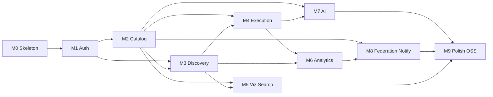

# GraphScope — Feature Breakdown (Phase 3)

| Field | Value |
|---|---|
| Product | GraphScope |
| Document | Milestones / Phase 3 |
| Status | Approved for implementation |
| Version | 1.2.0 |
| Last updated | 2026-08-05 |
| Primary deliverable | Local macOS `.dmg` — zero GraphScope servers |
| Depends on | [01-prd.md](./01-prd.md), [02-system-design.md](./02-system-design.md) |

---

## 1. Milestone Principles

1. **Independently deployable** — each milestone ships behind feature flags if incomplete neighbors exist.
2. **Vertical slices** — DB + API + UI (+ infra) for the milestone’s value, not horizontal “all backend then all frontend.”
3. **Definition of Done is normative** — no milestone closes without tests listed.
4. **Estimates** assume one senior full-stack engineer; calendar weeks include integration buffer.
5. **Desktop-first delivery** — every milestone advances the Mac Electron app toward v1 GA.
6. **Local-only** — no milestone may require GraphScope-hosted infrastructure.
7. **SQL-first** — each milestone ships migrations + repositories; no ORM.

### Phase-to-milestone mapping

| Spec phase | Outcome |
|---|---|
| Phase 1–2 | Local desktop + SQLite/no ORM locked |
| Phase 3 M0–M9 | Feature-complete local Mac app |
| Phase 4 | Sprint execution |
| Phase 5 | `.dmg` + landing page + **Product Hunt** |



---

## 2. Milestone M0 — Platform Skeleton

### Purpose
Monorepo + Electron shell + **local API stub** + **SQLite migration V001** — no Docker, no cloud.

### Feature List
- pnpm + Turborepo
- `apps/api` health-only NestJS monolith on loopback
- `apps/desktop` opens renderer
- `database/migrations/sqlite/V001__init_core.sql`
- `packages/db` connection + migrate runner (**no ORM**)
- `apps/landing` static stub
- CI: lint, typecheck, migration smoke on `:memory:` SQLite

### Database Changes
- V001: `core_workspace`, `core_project`, `core_job`, `audit_event` (see data engineering doc)

### Backend Tasks
- SQLite migrate on API boot
- Repository stub for workspace

### Desktop Tasks
- Spawn/kill API child process
- No Docker prerequisites UI

### Definition of Done
- [ ] `pnpm desktop:dev` opens app; API health OK
- [ ] Migrations apply on fresh DB
- [ ] No compose/docker in repo required to run

### Database Changes
- `users` (id, github_id nullable, email, name, created_at, updated_at)
- `organizations` (id, name, slug, created_at, updated_at)
- `_prisma_migrations`

### GraphQL Schema Changes
- Gateway + each subgraph: `Query.health: Health!`
- Federation `_service { sdl }` available on subgraphs

### Backend Tasks
- Scaffold Nest apps; shared `packages/config`, `packages/telemetry`, `packages/shared-types`
- Wire Prisma client package
- Uniform logging middleware

### Frontend Tasks
- Next.js App Router skeleton; `/app` shell; remove marketing-first assumption (desktop is the product)
- Tailwind + shadcn/ui init; CSS variables for brand
- Electron: `BrowserWindow`, dev loads `http://localhost:3000`, prod loads file:// or embedded static server

### Desktop Tasks
- Scaffold `apps/desktop` with electron-vite or electron-forge + pnpm workspace link to `apps/web`
- Register `graphscope://` protocol (stub handler)
- macOS menu template (app name, quit, edit, view, window)

### Infrastructure Tasks
- `docker-compose.yml`, Dockerfiles (multi-stage stubs)
- `deploy/electron/electron-builder.yml` stub
- `.env.example`
- `ci.yml` + `desktop-smoke.yml`

### Testing
- Unit: config env schema parse
- Smoke: compose health endpoints return 200
- CI must be green on empty feature set

### Edge Cases
- Port conflicts locally documented
- OpenSearch memory settings for local Docker

### Definition of Done
- [ ] `pnpm install && docker compose up` yields healthy gateway
- [ ] `pnpm desktop:dev` opens Electron window with Next.js UI
- [ ] CI green on main (including macOS Electron smoke)
- [ ] Turborepo builds all packages/apps
- [ ] No secrets committed

### Implementation Order
1. Workspace tooling → 2. packages → 3. services stubs → 4. web shell → 5. **desktop shell** → 6. compose → 7. CI → 8. README

### Dependencies
None.

### Complexity
**M**

### Estimated Time
**1.5 weeks**

### Potential Risks
Over-scaffolding unused abstractions — mitigate by keeping stubs thin.

---

## 3. Milestone M1 — Auth & Tenancy

### Purpose
Users can sign in with GitHub, create orgs/workspaces, manage members/roles, and call the gateway as an authenticated principal. Tenant isolation is proven.

### Feature List
- GitHub OAuth login/logout via **system browser + `graphscope://` deep link**
- JWT access + opaque refresh stored in **macOS Keychain**
- Organization / workspace CRUD
- Memberships + RBAC roles
- API key create/revoke (hashed)
- Audit events for authz-sensitive actions
- Desktop: login window flow, org switcher in app shell, members settings
- Cross-tenant denial test suite

### Database Changes
- Extend `users` with GitHub profile fields
- `workspaces`, `memberships`, `sessions`, `refresh_tokens`, `api_keys`, `audit_events`
- Indexes per system design

### GraphQL Schema Changes (identity subgraph)
```graphql
type User @key(fields: "id") { id: ID! email: String! name: String }
type Organization @key(fields: "id") { id: ID! name: String! slug: String! }
type Workspace @key(fields: "id") { id: ID! name: String! organizationId: ID! }
type Membership { id: ID! role: WorkspaceRole! user: User! }
enum WorkspaceRole { OWNER ADMIN EDITOR RUNNER VIEWER }
type ApiKey { id: ID! name: String! prefix: String! createdAt: DateTime! lastUsedAt: DateTime }
type AuditEvent { id: ID! action: String! actorId: ID! createdAt: DateTime! metadata: JSON }

type Query {
  me: User
  organization(id: ID!): Organization
  workspace(id: ID!): Workspace
  auditEvents(workspaceId: ID!, cursor: String, limit: Int): AuditEventConnection!
}
type Mutation {
  createOrganization(input: CreateOrganizationInput!): Organization!
  createWorkspace(input: CreateWorkspaceInput!): Workspace!
  inviteMember(input: InviteMemberInput!): Membership!
  updateMemberRole(input: UpdateMemberRoleInput!): Membership!
  removeMember(input: RemoveMemberInput!): Boolean!
  createApiKey(input: CreateApiKeyInput!): CreateApiKeyPayload! # returns raw once
  revokeApiKey(id: ID!): Boolean!
  logout: Boolean!
}
```

### Backend Tasks
- `AuthModule` OAuth + token issuance
- Guards: `JwtAuthGuard`, `ApiKeyGuard`, `AbilityGuard`
- `packages/auth` ability factory from role
- Audit writer helper
- Gateway auth middleware

### Frontend Tasks
- Pages: `/login`, `/app`, `/app/settings/members`
- Hooks: `useViewer`, `useWorkspace`, `useAbility`
- Components: `OrgSwitcher`, `MemberTable`, `RoleSelect`, `ApiKeyDialog`

### Desktop Tasks
- OAuth: open external browser; handle deep link in main; IPC token to renderer
- Keychain storage for refresh token via preload API
- Login error states when local engine offline

### Infrastructure Tasks
- Secrets for GitHub OAuth in compose/CI
- Redis for refresh/session

### Testing
- E2E OAuth (mocked GitHub)
- Unit ability matrix
- Integration IDOR tests across orgs
- Refresh rotation + reuse detection tests

### Edge Cases
- User with verified email colliding across GitHub accounts
- Last owner removal forbidden
- Expired access with valid refresh mid-request

### Definition of Done
- [ ] Login → create org → invite → role enforce works
- [ ] Cross-tenant tests required in CI and passing
- [ ] API key can authenticate CLI-shaped REST/GQL call
- [ ] Audit log records key create/revoke and role changes

### Implementation Order
1. Schema/DB → 2. OAuth/tokens → 3. RBAC → 4. Gateway wire-up → 5. UI → 6. isolation tests

### Dependencies
M0

### Complexity
**L**

### Estimated Time
**2 weeks**

### Potential Risks
OAuth redirect mismatch across environments — document callback URLs early.

---

## 4. Milestone M2 — Catalog & Schema Registry Core

### Purpose
Teams create projects, publish schema versions via CLI/CI, view history, and run breaking-change checks (non-federated).

### Feature List
- Projects CRUD
- Schema + immutable SchemaVersion
- MinIO/S3 SDL blob storage
- `schema:publish` / `schema:check` CLI
- REST `/v1/schemas/publish|check`
- Check job with Inspector rules
- UI: project home, version list, diff view
- Feature flag `registry.enabled`

### Database Changes
- `projects`, `schemas`, `schema_versions`, `schema_checks`
- `environments` (stub for M4: name + url nullable)
- Outbox table if not present

### GraphQL Schema Changes (catalog)
```graphql
type Project @key(fields: "id") {
  id: ID!
  name: String!
  workspaceId: ID!
  schemas: [Schema!]!
}
type Schema @key(fields: "id") {
  id: ID!
  name: String!
  versions(cursor: String, limit: Int): SchemaVersionConnection!
  latestVersion: SchemaVersion
}
type SchemaVersion @key(fields: "id") {
  id: ID!
  contentHash: String!
  sdl: String!
  gitSha: String
  createdAt: DateTime!
  checks: [SchemaCheck!]!
}
type SchemaCheck {
  id: ID!
  status: SchemaCheckStatus!
  result: SchemaCheckResult
  breakingCount: Int!
  dangerousCount: Int!
}
enum SchemaCheckStatus { PENDING RUNNING PASSED FAILED ERROR }
enum SchemaCheckResult { BREAKING DANGEROUS SAFE }

type Mutation {
  createProject(input: CreateProjectInput!): Project!
  # publish primarily via REST for CI, but GQL allowed for UI uploads
  publishSchema(input: PublishSchemaInput!): SchemaVersion!
}
```

### Backend Tasks
- Blob storage adapter (MinIO local / S3 prod)
- Normalize SDL + hash
- BullMQ `schema.check` worker
- OpenAPI for REST endpoints
- CLI package `@graphscope/cli`

### Frontend Tasks
- Pages: `/app/projects`, `/app/projects/[id]`, `/app/projects/[id]/schemas/[schemaId]`
- Components: `SchemaVersionTable`, `SchemaDiffViewer`, `CheckBadge`, `PublishDialog`

### Infrastructure Tasks
- MinIO bucket bootstrap script
- CI job for CLI smoke publish against compose

### Testing
- Idempotent publish same hash
- Fixture schemas: breaking vs safe
- Authz: VIEWER cannot publish
- Blob missing → check ERROR state

### Edge Cases
- Invalid SDL upload
- Extremely large SDL (size limit e.g. 5MB)
- Concurrent publishes

### Definition of Done
- [ ] CLI publish → version visible in UI
- [ ] Breaking fixture fails check 100%
- [ ] Diff UI shows field add/remove
- [ ] Independently deployable with M1

### Implementation Order
1. DB/blob → 2. publish API → 3. check worker → 4. CLI → 5. UI diff → 6. fixtures

### Dependencies
M1

### Complexity
**L**

### Estimated Time
**2.5 weeks**

### Potential Risks
Inspector rule tuning false positives — ship config allowlist.

---

## 5. Milestone M3 — Repo Connect & Discovery

### Purpose
Connect GitHub repositories, sync commits, discover GraphQL operations, and browse them with source links.

### Feature List
- GitHub App install + webhook verification
- Repository enable/disable per project
- Queues: `vcs.sync`, `parse.repo`, `parse.pr`
- Parsers: file, tagged template, TS heuristics
- Operation browser + detail with GitHub deep link
- `.graphscopeignore`
- Manual mark/unmark operation
- Sync status UI

### Database Changes
- `repository_links`, `commit_snapshots`, `operation_documents`, `operation_source_locations`, `parse_jobs`

### GraphQL Schema Changes (parser + catalog)
```graphql
type RepositoryLink @key(fields: "id") {
  id: ID!
  projectId: ID!
  fullName: String!
  defaultBranch: String!
  status: RepoSyncStatus!
  lastIndexedSha: String
  lastError: String
}
enum RepoSyncStatus { CONNECTED SYNCING INDEXED ERROR DISABLED }

type OperationDocument @key(fields: "id") {
  id: ID!
  name: String
  operationType: OperationType!
  contentHash: String!
  content: String!
  confidence: Float!
  repository: RepositoryLink!
  locations: [OperationSourceLocation!]!
}
enum OperationType { QUERY MUTATION SUBSCRIPTION }
type OperationSourceLocation {
  path: String!
  startLine: Int!
  endLine: Int!
  githubUrl: String!
}

type Query {
  operations(projectId: ID!, filter: OperationFilter, cursor: String, limit: Int): OperationConnection!
  operation(id: ID!): OperationDocument
}
type Mutation {
  enableRepository(input: EnableRepositoryInput!): RepositoryLink!
  disableRepository(id: ID!): RepositoryLink!
  reindexRepository(id: ID!): RepositoryLink!
  setOperationManualFlag(id: ID!, isOperation: Boolean!): OperationDocument!
}
```

### Backend Tasks
- Webhook controller + signature verify
- Shallow clone worker with cleanup
- Parser strategy registry
- Dedupe by content hash
- Outbox `search.index` events (consumed in M5; persist anyway)

### Frontend Tasks
- Pages: `/app/projects/[id]/repos`, `/app/operations`, `/app/operations/[id]`
- Components: `RepoList`, `SyncStatusChip`, `OperationTable`, `SourceMapPanel`, `FilterBar`

### Infrastructure Tasks
- GitHub App credentials
- Ephemeral volume / tmp cleanup for clones
- Rate limit / backoff configuration

### Testing
- Golden fixture repos (≥3) with expected operation counts; recall ≥80%
- Webhook replay idempotency
- Ignore rules unit tests
- Malformed GraphQL files do not crash worker

### Edge Cases
- Monorepo with thousands of files
- Generated documents duplicated
- Anonymous operations
- Binary files skipped
- Private repo permission missing

### Definition of Done
- [ ] Install App → enable repo → operations appear < 10 min on sample
- [ ] Recall ≥80% on fixtures
- [ ] PR webhook triggers incremental parse
- [ ] Source links open correct GitHub lines

### Implementation Order
1. GitHub App + webhooks → 2. sync job → 3. parsers → 4. persistence → 5. UI → 6. golden tests

### Dependencies
M1, M2 (project exists)

### Complexity
**XL**

### Estimated Time
**3 weeks**

### Potential Risks
Parser accuracy; GitHub rate limits — fixtures + backoff critical.

---

## 6. Milestone M4 — Execution Workspace

### Purpose
Postman-like execution: environments, secrets, run operations, view history — with SSRF-safe proxying.

### Feature List
- Environments CRUD (URL, headers)
- Secrets write-only encryption
- Execute mutation with variables
- Execution history (redacted)
- Collections save/share in workspace
- Role gates for prod execute
- UI runner experience

### Database Changes
- Flesh out `environments`, `secrets`, `executions`, `collections`, `collection_items`

### GraphQL Schema Changes (execution + catalog)
```graphql
type Environment {
  id: ID!
  name: String!
  endpointUrl: String!
  isProduction: Boolean!
  headers: [HeaderInput!]! # values secret-masked on read
}
type SecretMeta { id: ID! name: String! lastFour: String! updatedAt: DateTime! }
type Execution {
  id: ID!
  status: ExecutionStatus!
  httpStatus: Int
  durationMs: Int!
  responseBytes: Int
  graphqlErrorsCount: Int!
  createdAt: DateTime!
  operation: OperationDocument
}
enum ExecutionStatus { SUCCESS GRAPHQL_ERROR TRANSPORT_ERROR BLOCKED TIMEOUT }

type Mutation {
  createEnvironment(input: CreateEnvironmentInput!): Environment!
  upsertSecret(input: UpsertSecretInput!): SecretMeta!
  deleteSecret(id: ID!): Boolean!
  executeOperation(input: ExecuteOperationInput!): ExecutionPayload!
  saveToCollection(input: SaveToCollectionInput!): CollectionItem!
}
```

### Backend Tasks
- SSRF module + DNS resolution checks
- Secret crypto service (AES-GCM + KMS wrap interface; local key for compose)
- Execute HTTP client with limits
- Emit `execution.completed`

### Frontend Tasks
- Pages: `/app/execute`, `/app/environments`, `/app/history`, `/app/collections`
- Components: `OperationEditor`, `VariablesForm`, `EnvPicker`, `ResponsePanel`, `HeadersEditor`, `SecretForm` (write-only)
- Hooks: `useExecute`, `useEnvironments`

### Infrastructure Tasks
- KMS/local `ENCRYPTION_MASTER_KEY`
- NetworkPolicy notes for egress

### Testing
- SSRF suite: private IPs, metadata IP, file://, redirects
- Secret never returned on read
- Prod execute forbidden for RUNNER
- Timeout + body cap tests
- History redaction tests

### Edge Cases
- Upstream returns non-JSON
- Multipart not supported (document rejection)
- Variable JSON invalid
- Endpoint changes mid-flight

### Definition of Done
- [ ] Execute discovered op against mock GraphQL upstream in compose
- [ ] SSRF suite green in CI
- [ ] Secrets encrypted at rest
- [ ] History usable for last N runs

### Implementation Order
1. Env/secret models → 2. SSRF → 3. execute → 4. history → 5. collections UI → 6. security tests

### Dependencies
M3 (operations), M2 (projects)

### Complexity
**L**

### Estimated Time
**2.5 weeks**

### Potential Risks
SSRF bypass via DNS rebinding — pin resolved IP for request where feasible.

---

## 7. Milestone M5 — Visualization & Search

### Purpose
Schema Voyager exploration and global search across operations/types/fields.

### Feature List
- Voyager-class schema viz from SchemaVersion SDL
- OpenSearch indices + indexer worker
- Search API + UI command palette / search page
- Rebuild index admin job

### Database Changes
- No major new tables; rely on outbox + maybe `search_checkpoints`

### GraphQL Schema Changes (search)
```graphql
type SearchResult {
  kind: SearchResultKind!
  id: ID!
  title: String!
  subtitle: String
  url: String!
  score: Float!
}
enum SearchResultKind { OPERATION TYPE FIELD REPOSITORY COLLECTION }
type Query {
  search(workspaceId: ID!, q: String!, kinds: [SearchResultKind!], limit: Int): [SearchResult!]!
}
```

### Backend Tasks
- OpenSearch mappings
- `search.index` worker
- Rebuild-from-PG
- Catalog endpoint to produce Voyager-friendly introspection JSON / SDL transform

### Frontend Tasks
- Pages: `/app/schema/explore`, `/app/search`
- Components: `SchemaVoyager`, `SearchPalette` (⌘K), `SearchResults`

### Infrastructure Tasks
- OpenSearch in compose with index templates
- Index ILM optional later

### Testing
- Index lag < 30s after publish/parse in compose
- Search relevance smoke tests
- Empty query handling
- Tenant filter: no cross-org hits

### Edge Cases
- Special characters in queries
- Schema with custom directives breaking viz
- Partial index during rebuild

### Definition of Done
- [ ] Voyager renders sample schema
- [ ] Search finds operation by name and type by name
- [ ] Cross-org search isolation tested

### Implementation Order
1. Mappings → 2. indexer → 3. search query → 4. UI palette → 5. Voyager page

### Dependencies
M2, M3

### Complexity
**M**

### Estimated Time
**2 weeks**

### Potential Risks
OpenSearch resource usage locally — document memory limits.

---

## 8. Milestone M6 — Analytics & Anti-Patterns

### Purpose
Score operations, detect anti-patterns, show workspace dashboards from execution + static analysis.

### Feature List
- Rule engine with GS001–GS007 (extensible)
- Findings on operations
- Complexity/depth computation on parse and on execute
- Rollup jobs + dashboard API
- UI findings panel + dashboard

### Database Changes
- `operation_findings`, `analytics_rollups`
- Optional columns on `operation_documents`: `depth`, `complexity`

### GraphQL Schema Changes (analytics)
```graphql
type OperationFinding {
  id: ID!
  ruleId: String!
  severity: FindingSeverity!
  message: String!
  path: String
}
enum FindingSeverity { LOW MEDIUM HIGH CRITICAL }

type WorkspaceDashboard {
  operationCount: Int!
  openHighFindings: Int!
  checksFailed7d: Int!
  execP50Ms: Float
  execP95Ms: Float
}

type Query {
  operationFindings(operationId: ID!): [OperationFinding!]!
  workspaceDashboard(workspaceId: ID!): WorkspaceDashboard!
}
```

### Backend Tasks
- RulesModule pure functions + worker `analytics.analyze_op`
- Consume `execution.completed`
- Rollup cron
- DataLoaders for findings

### Frontend Tasks
- Pages: `/app/analytics`
- Components: `FindingsList`, `SeverityBadge`, `DashboardCards`, `LatencyChart` (simple)

### Infrastructure Tasks
- Prometheus metrics for findings counts
- Grafana dashboard JSON snippet

### Testing
- Each rule unit-tested with positive/negative fixtures
- Rollup idempotency
- Dashboard authz

### Edge Cases
- Operations without schema binding (skip schema-aware rules)
- Huge selection sets performance — timeout rule evaluation budget

### Definition of Done
- [ ] Findings appear on fixture anti-pattern operations
- [ ] Dashboard shows non-zero metrics after seed executes
- [ ] Rules documented in docs for users

### Implementation Order
1. Rule engine → 2. persist findings → 3. execution consumer → 4. rollups → 5. UI

### Dependencies
M3, M4 (richer with execute; static findings can start after M3)

### Complexity
**L**

### Estimated Time
**2.5 weeks**

### Potential Risks
Rule noise → ship severities + mute per project later.

---

## 9. Milestone M7 — AI Copilot

### Purpose
Schema-aware explain/generate with redaction modes, budgets, and caching.

### Feature List
- `explainOperation` / `generateOperation`
- Redaction modes: `strict`, `standard`, `full`
- Org AI budget + rate limits
- Redis response cache
- UI side panel on operation / editor
- Feature flag `ai.enabled`

### Database Changes
- `ai_budgets`, `ai_invocations` (metadata: tokens, mode, schemaVersionId; prompt optional)

### GraphQL Schema Changes (ai)
```graphql
enum AiRedactionMode { STRICT STANDARD FULL }
type AiExplanation { markdown: String! citations: [SchemaCitation!]! }
type SchemaCitation { typeName: String! fieldName: String }
type AiGeneratedOperation { document: String! warnings: [String!]! }

type Query {
  # none required
}
type Mutation {
  explainOperation(input: ExplainOperationInput!): AiExplanation!
  generateOperation(input: GenerateOperationInput!): AiGeneratedOperation!
  updateAiSettings(input: UpdateAiSettingsInput!): AiSettings!
}
```

### Backend Tasks
- LangChain chains + OpenAI provider
- Schema subset retriever
- Budget enforcement
- Safety filters (no secrets)

### Frontend Tasks
- Components: `AiSidePanel`, `AiModeSelect`, `CitationList`
- Integrate on operation detail + execute page

### Infrastructure Tasks
- `OPENAI_API_KEY` secret
- Optional staging mock provider for CI

### Testing
- Redaction: strict does not include full SDL dump
- Budget exceeded returns `RATE_LIMITED` / `BUDGET_EXCEEDED`
- Cache hit reduces provider calls (unit with mock)
- CI uses mock LLM

### Edge Cases
- Provider timeout
- Hallucinated fields — validate generated document against schema; reject invalid

### Definition of Done
- [ ] Explain returns citations for sample op
- [ ] Generate validates against schema version
- [ ] CI green without real OpenAI key (mock)

### Implementation Order
1. Provider interface + mock → 2. explain → 3. generate+validate → 4. budgets → 5. UI

### Dependencies
M2, M4 (and M3 for real ops)

### Complexity
**M**

### Estimated Time
**2 weeks**

### Potential Risks
Cost overruns — hard budgets default ON.

---

## 10. Milestone M8 — Polish Jobs, Optional MySQL & Federation Checks (local)

### Purpose
Local federation-style **schema composition checks** (SDL merge only), optional MySQL engine toggle, macOS notifications — still **no servers**.

### Feature List
- Optional Settings → Database → MySQL connection + `mysql/` migrations
- Local supergraph SDL merge validation (not Apollo Router)
- macOS Notification Center on parse/check complete
- Gateway hardening: complexity/depth limits in local Apollo Server

### Definition of Done
- [ ] App runs fully on SQLite with zero external deps
- [ ] MySQL mode smoke-tested if enabled
- [ ] No network call to GraphScope domains

### Purpose
Compose Federation v2 subgraphs for the *product* graph maturity and customer registry composition; ship email notifications; harden for staging.

### Feature List
- Customer schema composition job + UI errors
- Platform supergraph composition in CI (already partially in M0–M2 — finalize)
- Email notifications for check failures / index complete
- Slack stub interface (optional enable)
- Rate limiting defaults tuned
- Complexity/depth limits on gateway
- Persisted queries (APQ) enabled

### Database Changes
- `schema_subgraphs`, `supergraph_compositions`
- `notification_preferences`, `notification_deliveries`

### GraphQL Schema Changes
```graphql
type SupergraphComposition {
  id: ID!
  status: CompositionStatus!
  errors: [CompositionError!]!
  createdAt: DateTime!
}
type Mutation {
  registerSubgraphSchema(input: RegisterSubgraphInput!): SchemaVersion!
  composeSupergraph(projectId: ID!): SupergraphComposition!
  updateNotificationPreferences(input: NotificationPrefsInput!): NotificationPreferences!
}
```

### Backend Tasks
- Composition worker using `@apollo/composition` or rover equivalent library
- SMTP email dispatcher via Mailhog local
- Gateway plugins hardening

### Frontend Tasks
- Composition status page
- Notification settings
- Banner for composition errors

### Infrastructure Tasks
- Helm charts for staging
- Alert rules for queue lag / 5xx
- Cert-manager annotations documented

### Testing
- Compose success/failure fixtures
- Email rendered + idempotent delivery
- Load smoke (k6) on gateway

### Edge Cases
- Subgraph SDL incompatible versions
- Email soft-bounce handling (log only MVP)

### Definition of Done
- [ ] Composition fixtures pass/fail correctly
- [ ] Email received in Mailhog for failed check
- [ ] Staging Helm deploy documented and performed once
- [ ] APQ + complexity limits active

### Implementation Order
1. Platform CI composition finalize → 2. customer compose → 3. notify email → 4. gateway hardening → 5. Helm staging

### Dependencies
M2+, M6 recommended

### Complexity
**L**

### Estimated Time
**2.5 weeks**

### Potential Risks
Federation API churn — pin package versions via ADR.

---

## 11. Milestone M9 — Polish, Production & Open Source

### Purpose
Public-launch readiness: **signed macOS desktop release**, docs, demo data, monitoring, OSS meta, portfolio narrative. Details normative in [05-production-oss.md](./05-production-oss.md).

### Feature List
- Seed/demo script + sample upstream GraphQL API
- README, CONTRIBUTING, SECURITY, LICENSE, templates
- **macOS `.dmg` build: sign, notarize, staple**
- **electron-updater** channel to GitHub Releases
- Screenshots from **desktop app** (not browser)
- Demo script (install dmg → first run → index → execute)
- Benchmarks harness
- Production checklist completion
- Portfolio story / resume bullets / interview kit

### Database Changes
- Seed data only

### GraphQL Schema Changes
- None required (docs/fix flags)

### Backend Tasks
- Demo seed; fix residual bugs from soak
- Persist query / pagination audit

### Frontend Tasks
- Empty states polish; loading/error polish; desktop window chrome polish
- Capture screenshots from Electron builds

### Desktop Tasks
- `electron-builder` production config (DMG, icons, entitlements)
- Apple Developer ID signing + notarization pipeline in CI
- First-run wizard: Docker check → start engine → login
- Auto-update smoke test

### Infrastructure Tasks
- Mac release workflow (`release-mac.yml`)
- Backup restore drill doc (local Postgres volume)
- Grafana dashboards committed (optional for local obs stack)

### Testing
- Full e2e happy path script
- Benchmark numbers recorded in docs

### Edge Cases
- Gatekeeper blocks unsigned build (must not ship unsigned)
- Docker not installed on first run
- Rosetta vs native arm64 performance note in README

### Definition of Done
- [ ] Phase 5 checklist ≥95% complete
- [ ] **Signed, notarized `.dmg` installs on clean Mac**
- [ ] Demo completes < 8 minutes from `.dmg` install
- [ ] OSS meta files present
- [ ] Spec index links all docs

### Implementation Order
Follow Phase 5 document order.

### Dependencies
M0–M8

### Complexity
**M**

### Estimated Time
**2 weeks**

### Potential Risks
Docs drift — generate architecture snippets from code where possible.

---

## 12. Cross-Milestone Feature Flag Matrix

| Flag | Default MVP | Introduced |
|---|---|---|
| `registry.enabled` | true | M2 |
| `discovery.enabled` | true | M3 |
| `execution.enabled` | true | M4 |
| `search.enabled` | true | M5 |
| `analytics.enabled` | true | M6 |
| `ai.enabled` | false → true when key present | M7 |
| `federation.compose.enabled` | false → true | M8 |
| `notify.slack.enabled` | false | M8 |

---

## 13. Total Calendar (solo senior)

| Milestone | Weeks | Cumulative |
|---|---|---|
| M0 | 1.5 | 1.5 |
| M1 | 2 | 3.5 |
| M2 | 2.5 | 6 |
| M3 | 3 | 9 |
| M4 | 2.5 | 11.5 |
| M5 | 2 | 13.5 |
| M6 | 2.5 | 16 |
| M7 | 2 | 18 |
| M8 | 2.5 | 20.5 |
| M9 | 2 | **22.5 weeks** |

Parallelization (2 engineers) can compress ~30–35% by splitting FE/BE within milestones after M1.

---

## 14. Acceptance Criteria (Phase 3)

- [x] Milestones M0–M9 each include Purpose, Features, DB, GQL, BE, FE, Infra, Testing, Edge Cases, DoD, Order, Deps, Complexity, Estimate, Risks
- [x] Dependency graph defined
- [x] Independently deployable principle + feature flags
- [x] Estimates and totals provided
- [x] Desktop-first macOS delivery reflected in M0, M1, M9 and principles

**Exit criterion:** Proceed to [04-implementation-plan.md](./04-implementation-plan.md).

---

## Document history

| Version | Date | Notes |
|---|---|---|
| 1.0.0 | 2026-08-05 | Initial feature breakdown |
| 1.1.0 | 2026-08-05 | Desktop-first milestones; Electron tasks |
