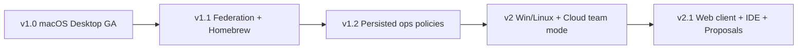

# GraphScope — Polish, Production & Open Source (Phase 5)

| Field | Value |
|---|---|
| Product | GraphScope |
| Document | Production / OSS Launch / Phase 5 |
| Status | Approved for implementation |
| Version | 1.2.0 |
| Last updated | 2026-08-05 |
| Primary deliverable | Local `.dmg` + landing page + Product Hunt |
| Depends on | [04-implementation-plan.md](./04-implementation-plan.md) |

---

## 1. Purpose

Everything required before **Product Hunt launch** and **GitHub Releases v1.0.0**: local Mac app, landing page (only deploy), OSS meta, zero server ops.

---

## 2A. Product Hunt Launch Checklist

### 2A.1 Positioning

- **Tagline:** *The open source Postman for GraphQL — free on your Mac.*
- **Differentiator:** Postman-familiar daily use + GraphQL-native depth; Apache 2.0; no account; no GraphScope servers
- **Audience:** GraphQL engineers tired of browser tabs and cloud lock-in

### 2A.2 Required assets

- [ ] Landing page live with hero, 3 features, download button → GitHub Releases latest `.dmg`
- [ ] Product Hunt gallery: icon 240×240, cover 1270×760, 3–5 screenshots
- [ ] 60–90s demo GIF (desktop: index repo → run query → schema check)
- [ ] Maker comment draft (local privacy, stack, roadmap)
- [ ] GitHub README install section matches landing
- [ ] First Release tagged `v1.0.0` with notarized `.dmg` attached

### 2A.3 Launch day

- [ ] PH listing goes live at 12:01 AM PT (optional schedule)
- [ ] Monitor GitHub Issues only — **no server dashboards**
- [ ] Respond on PH + GitHub with install troubleshooting (Gatekeeper, arm64)

### 2A.4 Maintainer deploy surface (only)

| Asset | Host |
|---|---|
| `apps/landing` | Vercel / Cloudflare Pages / GitHub Pages |
| `.dmg` | GitHub Releases (via `release-mac.yml`) |

**Nothing else.** No API, DB, Redis, webhooks, or auth servers.

---

## 2B. Open Source Launch Checklist

- [ ] `LICENSE` (Apache 2.0) in repo root
- [ ] `CONTRIBUTING.md` — clone, build, run desktop, submit PR
- [ ] `CODE_OF_CONDUCT.md`, `SECURITY.md`
- [ ] Issue templates: bug, feature, parser false negative
- [ ] PR template with test plan
- [ ] README: “Use like Postman” table + GitHub Releases download
- [ ] `good first issue` labels on starter tasks
- [ ] GitHub Discussions enabled (optional)
- [ ] Release notes template for each `.dmg` tag
- [ ] First-time user doc: install → collection → environment → execute (Postman workflow)

## 2C. Postman-like UX checklist (release gate)

- [ ] Create/rename/delete **collection**
- [ ] Save operation to collection from runner
- [ ] Create **environment** with URL + headers
- [ ] Switch environment and re-execute without re-pasting query
- [ ] **History** lists recent runs with status + ms
- [ ] Runner: query editor + variables JSON + response panel
- [ ] ⌘K opens global search
- [ ] New user completes above flow in < 5 minutes without docs

---

### 2.1 Security

- [ ] SSRF unit + integration suite green in CI (required gate)
- [ ] Secrets encrypted at rest; no plaintext read-back API
- [ ] JWT short TTL; refresh rotation + reuse detection verified
- [ ] Cross-tenant IDOR suite required gate
- [ ] Webhook HMAC verified; replay tolerance documented
- [ ] Dependency scanning (Dependabot) + CodeQL enabled
- [ ] Container images scanned; non-root; no secrets in images
- [ ] CSP, secure cookies, CORS allowlist on web
- [ ] AI redaction default `standard`; budgets enforced
- [ ] SECURITY.md with private disclosure channel
- [ ] Audit log covers PRD-sensitive actions

### 2.2 Reliability

- [ ] `/healthz` and `/readyz` on all services
- [ ] HPA configured for gateway, parser, execution
- [ ] Postgres automated daily backups; restore drill documented + performed
- [ ] Redis failure mode: degrade gracefully (sessions/rate limits)
- [ ] DLQ alerts for BullMQ
- [ ] Staging soak ≥ 72 hours
- [ ] RPO ≤ 24h / RTO ≤ 4h validated

### 2.3 Performance & GraphQL safety

- [ ] Cursor pagination on all list fields
- [ ] DataLoader on all nested FK resolutions
- [ ] Gateway depth limit enabled
- [ ] Gateway complexity analysis enabled
- [ ] APQ / persisted queries enabled
- [ ] Rate limiting per IP + per principal
- [ ] N+1 regression test (assert query count)
- [ ] Schema version immutability tested
- [ ] Hot schema SDL cached in Redis
- [ ] p95 interactive SLO measured on staging

### 2.4 Observability

- [ ] OTel traces across gateway → subgraphs → workers
- [ ] Prometheus metrics scraped
- [ ] Grafana dashboards: RED, queues, parse, execute, AI tokens
- [ ] Alerts: 5xx, queue lag, error budget, backup failure
- [ ] Structured logs without secrets
- [ ] Example trace deep-link in runbook

### 2.5 Desktop (macOS v1)

- [ ] Fresh Mac: download `.dmg` from GitHub — **no Docker, no MySQL, no signup**
- [ ] SQLite created on first launch under Application Support
- [ ] API binds 127.0.0.1 only
- [ ] GitHub Device Flow works without GraphScope server
- [ ] Signed + notarized; Gatekeeper passes
- [ ] electron-updater points to GitHub Releases

### 2.6 Product readiness

- [ ] Demo seed script idempotent
- [ ] Sample upstream GraphQL API in compose
- [ ] Empty states for all major pages
- [ ] Feature flags documented
- [ ] CLI published or runnable via `pnpm`

---

## 3. Performance Optimizations

| Area | Optimization |
|---|---|
| Gateway | APQ; persisted query hash; response caching only for pure introspection if safe |
| Catalog | Redis cache schema SDL by `contentHash`; Voyager JSON cache |
| Parser | Incremental path parse; commit SHA cache; worker concurrency caps |
| Execution | Keep-alive HTTP agents; timeout budgets; parallel not used for single op |
| Search | Bulk index; filter by orgId term first |
| Web | RSC where possible; Apollo cache; route-level code split; avoid giant Voyager bundle on home |
| DB | covering indexes; partition executions later; read replica for dashboards |

---

## 4. Caching Strategy

| Layer | What | Invalidation |
|---|---|---|
| Redis | SDL, Voyager graph, AI responses, APQ bodies | Publish/hash change; TTL |
| CDN | Next.js static assets in `.app` bundle | Build hash |
| Desktop | Voyager chunk lazy-loaded | Route split |
| Apollo Client | Operation detail, viewer | Mutation evict |
| HTTP | None for authenticated GQL by default | — |

**Rule:** Never cache responses containing secrets or cross-tenant data without explicit org keying.

---

## 5. Rate Limiting

| Bucket | Default | Notes |
|---|---|---|
| Anonymous IP | 60 rpm | Health excluded |
| Authenticated user | 600 rpm | Gateway |
| API key | 300 rpm | CI burst configurable |
| Execute | 30 rpm / user | Separate limiter |
| AI | 20 rpm / user + monthly tokens | Hard stop |

Store counters in Redis (`rl:` prefix). Return GraphQL error `RATE_LIMITED` with `Retry-After`.

---

## 6. Pagination

- Standard connection model: `edges { cursor node } pageInfo { hasNextPage endCursor }`
- Opaque cursor = base64(`createdAt|id`)
- Max `limit` = 100 (default 25)

---

## 7. GraphQL Complexity & Depth

| Control | Default |
|---|---|
| Max depth | 12 |
| Max complexity | 1000 |
| Introspection | Disabled in prod gateway for public; enabled for authenticated admin tooling as needed |

Customer **operation** complexity scoring (analytics) is separate from **platform API** complexity limits.

---

## 8. Persisted Queries

- APQ on gateway for web client
- P1 product feature: org persisted operation allowlist for **customer** prod environments (`US-046`)
- Document migration path from APQ cache to durable persisted ops store

---

## 9. N+1 Prevention & DataLoader

Mandatory DataLoaders per subgraph:

- `userById`, `orgById`, `workspaceById`
- `projectById`, `schemaVersionById`
- `operationById`, `findingsByOperationId`
- `repositoryById`, `executionsByOperationId` (bounded)

CI test: resolving operation list with findings does not scale linearly in SQL queries.

---

## 10. Schema Versioning

- Immutable `SchemaVersion` rows
- Checks always against explicit base version (default: previous)
- Soft-delete schemas; versions retained for audit
- Federation composition artifacts versioned separately

---

## 11. Documentation Set (repo files to create at launch)

| File | Purpose |
|---|---|
| `README.md` | Product pitch, quickstart, architecture thumbnail |
| `docs/spec/*` | This specification series |
| `docs/architecture/overview.md` | Living architecture |
| `docs/adr/*` | Decisions |
| `docs/deploy/README.md` | Compose + Kubernetes |
| `docs/develop/README.md` | DX, codegen, testing |
| `CONTRIBUTING.md` | Contribution guide |
| `SECURITY.md` | Vulnerability disclosure |
| `CODE_OF_CONDUCT.md` | Community norms |
| `LICENSE` | Apache-2.0 |
| `CHANGELOG.md` | Keep-a-changelog |
| OpenAPI | `docs/openapi/cli-rest.yaml` for publish/check/webhooks |

---

## 12. README Requirements (content outline)

1. One-line pitch + tagline
2. Screenshot collage
3. Feature list (discovery, registry, execute, viz, analytics, AI)
4. Architecture diagram (link to Mermaid in spec)
5. Quickstart (`pnpm i`, `docker compose up`, seed)
6. CLI examples
7. Tech stack badges
8. Roadmap link
9. License + security link

---

## 13. Contribution Guide (requirements)

- Prerequisites: Node 22+, pnpm, Docker
- Setup steps; how to run a single service
- Branch naming; commit conventional commits
- PR checklist (tests, tenant tests if data touch, docs)
- Code style; codegen workflow
- How to add an analytics rule
- How to add a parser strategy

---

## 14. Issue & PR Templates

### Issue templates
- `bug_report.yml` — severity, repro, tenant impact
- `feature_request.yml` — persona, FR mapping
- `security.yml` — points to SECURITY.md (no public vulns)

### PR template
- Summary, test plan, risk, screenshots, checklist (tenant isolation, SSRF, migrations)

---

## 15. Security Policy

- Report via private email / GitHub Security Advisories
- SLA targets: critical 72h initial response; no public issues for vulns
- Supported versions: latest minor on `main` + last release tag

---

## 16. License

**Apache License 2.0** — recommended for OSS graph tooling (patent grant clarity, enterprise-friendly).

---

## 17. GitHub Actions (launch set)

Ensure workflows from Phase 4 are enabled on the public repo with secrets scoped to Environments `staging` / `prod`. Branch protection: required CI + composition check.

---

## 18. Testing Strategy (release)

| Layer | Tooling | Gate |
|---|---|---|
| Unit | Vitest/Jest | Required |
| Integration | Compose + testcontainers-style | Required |
| E2E | Playwright | Required on main |
| Security | SSRF + IDOR suites | Required |
| Load | k6 | Nightly / pre-release |
| Parse accuracy | Golden fixtures | Required (≥80% recall) |

---

## 19. Benchmarking

Record in `docs/benchmarks/RESULTS.md`:

| Bench | Method | Target |
|---|---|---|
| Parse 10k GraphQL files | fixture corpus worker | < 120s on 4 vCPU |
| Execute proxy overhead | mock upstream | p95 < 50ms |
| Search p95 | 100k ops index | < 400ms |
| Schema check | large SDL pair | < 5s |

---

## 20. Monitoring & Alerts

| Alert | Condition |
|---|---|
| GatewayHigh5xx | 5xx rate > 2% / 5m |
| QueueLagParse | `parse.repo` lag > 1000 for 10m |
| PostgresConnections | > 80% max |
| BackupFailed | job failure |
| AiBudgetStorm | token burn > 3× daily baseline |

---

## 21. Deployment Guide (summary)

### 21.1 macOS desktop v1 (primary)

1. Install Apple Developer ID Application certificate
2. Configure GitHub secrets: `APPLE_*`, `CSC_*`
3. Tag `v1.0.0` → `release-mac.yml` builds, signs, notarizes
4. Publish `GraphScope-{version}.dmg` to GitHub Releases
5. User installs → opens app → installs Docker Desktop if missing → starts local engine → logs in with GitHub
6. Run desktop e2e smoke on release artifact

### 21.2 v2+ optional: cloud team backend

Full steps for Helm/K8s team-hosted mode: `docs/deploy/README.md` (created during M9).

---

## 22. Demo Data

`tools/scripts/seed-demo.ts` creates:

- Org **Acme Graph**
- Users: Asha (editor), Ben (admin), Cara (owner)
- Project **Storefront API** with schema versions v1→v3 (breaking in v3 check fail sample)
- Repo link to `apps/demo-upstream` sample operations
- Environments: Staging + Prod (prod execute restricted)
- Executions + findings for dashboard
- Collections: “Checkout critical path”

Sample upstream schema: `User`, `Product`, `Order`, federation-ready later.

---

## 23. Screenshots to Capture

Capture from **Electron desktop builds**, not browser:

1. First-run wizard (Docker + engine + login)
2. App home / project list
3. Operation discovery list with filters
4. Operation detail + GitHub source map
5. Schema version diff with failing breaking check
6. Voyager schema explore
7. Execute runner with response + latency
8. Analytics dashboard + findings
9. AI explain panel with citations
10. ⌘K search palette
11. Settings → Local Engine panel
12. About / version screen with signed build info

Store under `docs/images/desktop/`.

---

## 24. Portfolio Story

### Narrative (≈150 words)

> GraphScope is a local-first GraphQL workspace for macOS I designed as a zero-ops open source product. It ships as a signed `.dmg` from GitHub — no GraphScope servers, no account, no Docker. The Electron app spawns a NestJS API on loopback with SQLite (optional local MySQL), raw SQL migrations, and layered staging/core/mart tables — deliberately no ORM. It discovers operations from your repos, registers schemas, runs SSRF-safe execution, and analyzes anti-patterns with optional OpenAI (user's key). I built it for a Product Hunt launch with only a static landing page deployed. The architecture demonstrates data engineering discipline, desktop shipping, and GraphQL depth without SaaS babysitting.

### Resume bullet points

- Built **GraphScope**, a **local-only macOS GraphQL desktop app** — GitHub Releases distribution, zero maintainer servers.
- Designed **SQLite + raw SQL** data layer (`stg_`/`core_`/`mart_`) with versioned migrations — **no ORM**.
- Implemented local **NestJS monolith** + Electron lifecycle + Keychain secrets + GitHub Device Flow.
- Shipped **Product Hunt** launch playbook: landing page only deploy, notarized `.dmg` CI.

### Interview questions (with intent)

| Question | What it probes |
|---|---|
| Why Federation instead of a modular monolith? | Tradeoff judgment |
| Why desktop instead of web SaaS for v1? | Product + delivery strategy |
| How does desktop OAuth work on Mac? | Deep link + Keychain |
| How does the local engine start? | Sidecar / Compose manager |
| How do you prevent cross-tenant IDOR? | Security depth |
| How does the parser avoid false positives? | Heuristics + evaluation |
| Walk through an execute call end-to-end | Systems storytelling |
| How would you scale to 100M executions/year? | Capacity planning |
| How do you keep AI from leaking secrets/SDL? | AI safety |
| What’s in your schema check CI gate? | API lifecycle |
| How do you handle GitHub rate limits? | Integration realism |
| When would you split the database? | Evolutionary architecture |
| What would you cut to ship in 8 weeks? | Product sense |

---

## 25. Future Improvements (post-GA)

- Consumer impact graph (field → operations)
- Migration AI for breaking changes
- VS Code extension
- GitLab support
- SAML SSO
- Persisted-ops enforcement UX
- ClickHouse analytics path
- Cell-based isolation for enterprise

---

## 26. v2 Roadmap

| Theme | Items |
|---|---|
| **Desktop platforms** | Windows, Linux (AppImage/deb) — same Electron shell |
| **Distribution** | Homebrew cask, optional auto-update channels |
| **Cloud team mode** | Hosted backend; desktop as thin-ish client |
| Multi-VCS | GitLab, Bitbucket |
| Enterprise auth | SAML/OIDC, SCIM |
| Commercial | Seat + usage billing |
| Self-host | Helm GA for team backends |
| IDE | VS Code + JetBrains thin clients |
| Graph governance | Proposals, approvals, ownership |
| Runtime insights | Optional usage reporting agents |
| **Web client** | Browser app for teams without desktop install |

---

## 27. Open Source Launch Checklist

- [ ] Public GitHub repo
- [ ] LICENSE Apache-2.0
- [ ] SECURITY / CONTRIBUTING / CODE_OF_CONDUCT
- [ ] Issue + PR templates
- [ ] Good first issues labeled
- [ ] Demo GIF/screenshots in README
- [ ] Discord/Discussions optional
- [ ] Tag `v1.0.0` with `.dmg` asset
- [ ] Show HN / LinkedIn post draft (optional; lead with desktop demo GIF)

---

## 28. Acceptance Criteria (Phase 5)

- [x] Production checklist includes **macOS desktop GA** requirements
- [x] Caching, rate limits, pagination, complexity, APQ, DataLoader, versioning specified
- [x] Documentation, OSS meta, CI, testing, benchmarks, monitoring, deploy guide outlined
- [x] Demo data + desktop screenshots list
- [x] Portfolio story, resume bullets, interview kit (desktop-aware)
- [x] Future improvements + v2 roadmap (Win/Linux/cloud/web)

**Exit criterion:** Specification complete; implementation may begin at M0 / Sprint S0 with **Electron shell**.

---

## Document history

| Version | Date | Notes |
|---|---|---|
| 1.0.0 | 2026-08-05 | Initial production & OSS guide |
| 1.1.0 | 2026-08-05 | macOS desktop GA focus; sign/notarize checklist |
